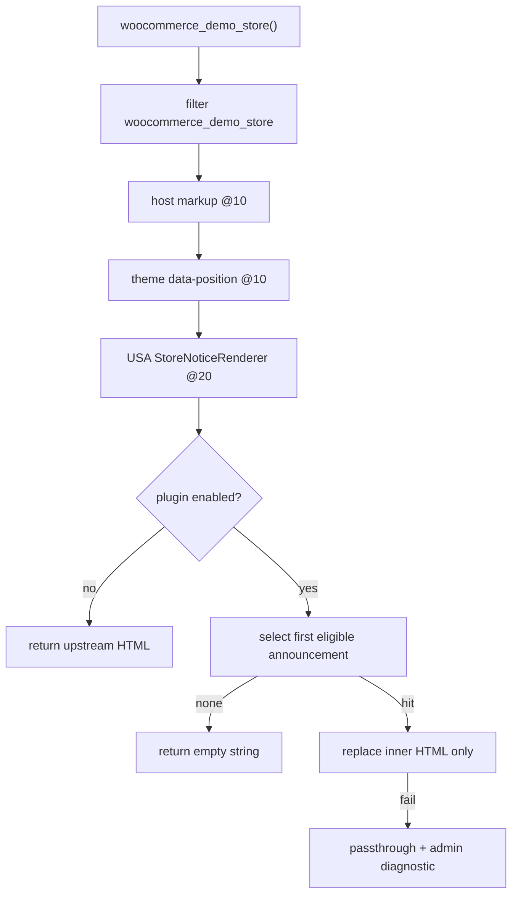

# M1 — Core Manual Announcement Bar

**Status:** FROZEN — PO APPROVED  
**Repository:** [magpern/universal-site-announcements](https://github.com/magpern/universal-site-announcements)  
**Plugin:** Universal Site Announcements (`universal-site-announcements`)  
**Namespace:** `USA\`  
**Parent architecture:** [MASTER_PLAN.md](MASTER_PLAN.md) (M0 frozen)  
**Frozen:** 2026-08-23

---

## 1. Audited baseline

| Item | Value |
|------|--------|
| Default branch | `main` |
| M0 merge SHA | `755b6c3799840aef90e0ad7953e476e24eee77d7` |
| Plugin code before M1 | Absent (documentation-only repository) |
| Integration seam | WooCommerce Store Notice filter `woocommerce_demo_store` |
| WC filter signature | `apply_filters( 'woocommerce_demo_store', $html, $notice )` |
| Typical upstream order | Priority 10: host markup rewrite (2 args); priority 10: theme adds `data-position` on `
` (1 arg) |
| USA filter priority | **20** |
| Outer markup contract | `
` with all upstream attributes preserved |
| Host styling | Existing theme/companion CSS for `.woocommerce-store-notice.demo_store` (not owned by USA) |
| Prerequisite | `woocommerce_demo_store=yes` so the notice function runs and host styles enqueue |

---

## 2. Objective

Deliver the generic plugin foundation and a server-rendered manual announcement bar that preserves the host site’s existing WooCommerce Store Notice appearance and provides safe editable inline links.

---

## 3. Scope

### In M1

- Plugin bootstrap, Composer PSR-4 `USA\` → `src/`, version `0.1.0`, WordPress 6.5+, PHP 8.1+.
- PHPUnit and WordPress coding-standard tooling.
- USA-owned global enable setting (`manage_options`, filterable via `usa_manage_cap`).
- Private CPT `usa_announcement` with admin UI.
- Manual content with sanitised inline links only.
- Meta: enabled, priority, source=`manual`.
- Deterministic single-message selection (priority ASC, ID ASC).
- `StoreNoticeRenderer` on `woocommerce_demo_store` at priority 20 with content-replacement contract below.
- Activation seed with empty-fallback edge case.
- Fail-safe passthrough + admin diagnostic.
- README prerequisites and rollback notes.
- Unit and integration tests; development-site acceptance.

### Out of M1; deferred to M2

- Schedule fields, metadata, and evaluation.
- Rotation, fade, pause/resume, front-end JavaScript/animation.
- WooCommerce free-shipping provider.
- Universal Multicurrency threshold-display API integration.
- Currency calculation or formatting beyond host/WC behaviour.

### Explicit non-goals for M1

- Mutating `woocommerce_demo_store` or `woocommerce_demo_store_notice`.
- Shipping zones/methods, theme files, host-plugin files.
- CSS redesign of the host bar.
- Geolocation, targeting, analytics, Elementor widgets.
- Cart free-shipping progress-bar fixes (other projects).
- Public release tag, ZIP, or production deployment.

---

## 4. Architecture

### Bootstrap and autoloading

- Main file: `universal-site-announcements.php`.
- Composer: `"USA\\": "src/"`, PHP `>=8.1`, require-dev PHPUnit + WPCS.
- Soft dependency: WooCommerce present for the store-notice filter; document store-notice enable as installation prerequisite.

### Settings and lifecycle

- Setting: `usa_plugin_enabled` (bool), default `true` on activation.
- Capability: `manage_options` via filter `usa_manage_cap`.
- Activation: enable plugin; seed per §5; never write WC options.
- Deactivation: do not delete CPT data; do not touch WC options; filter unload restores WC path.

### Content ownership

| State | Behaviour |
|-------|-----------|
| Plugin inactive | Upstream WC + host pipeline unchanged |
| Enabled + ≥1 eligible announcement | USA replaces inner content |
| Enabled + 0 eligible | Empty string — **no bar** |
| Disabled | Pass upstream HTML through unchanged |
| After deactivation | Original WC notice returns; data retained |

### Announcement model

| Field | Notes |
|-------|--------|
| `post_title` | Admin label only |
| `post_content` | Front-end HTML; inline links only |
| `_usa_enabled` | Bool |
| `_usa_priority` | Int; lower first; default 10 |
| `_usa_source` | `manual` only in M1 |

Selection: published + enabled + source manual; sort priority ASC, ID ASC; **render first only**.

Sanitisation (save and render): `wp_kses` allowlist `a[href|target|rel]`, `strong`, `em`, `br`. If `target=_blank`, force `rel` to include `noopener noreferrer`.

### Content-replacement contract

**Behavioural contract (frozen):**

1. Preserve the upstream outer `
`.
2. Preserve the **original validated opening-tag fragment** (do not rebuild from an attribute map).
3. Preserve all attributes, including `data-position`, `role`, `aria-label`, `data-notice-id`, and future compatible attributes.
4. Replace **only** inner HTML with sanitised announcement content.
5. From `style`, remove **only** `display:none` / `display: none` (and equivalent); preserve other declarations (e.g. `color: red`).
6. On recognition/transform failure: return upstream HTML unchanged; throttled admin diagnostic; never invent a synthetic outer element.

**Mechanism (engineering verification gate):** Do not freeze a library choice in this document. During implementation, run a focused verification spike against real host-filtered markup and fixtures. Accept WordPress HTML API, carefully constrained fragment splicing, or a hybrid **only after** proving the contract. Record the selected mechanism and evidence in M1 closure documentation. If no safe mechanism works, stop and report a blocker; do not weaken the contract.

---

## 5. Activation seed

1. Set `usa_plugin_enabled` = true.
2. If any `usa_announcement` already exists → do not seed.
3. Read `woocommerce_demo_store_notice` (read-only).
4. Sanitise with USA allowlist.
5. If sanitised text is non-empty → create one enabled published manual announcement with that content.
6. If empty or missing → create no announcement (enabled + empty ⇒ no bar).
7. Never `update_option` on WooCommerce keys.

---

## 6. File-level work packages

- `universal-site-announcements.php`, `composer.json`, `phpunit.xml.dist`, `phpcs.xml.dist`, `readme.txt`
- `src/Plugin.php`
- `src/Lifecycle/Activator.php`, `src/Lifecycle/Deactivator.php`
- `src/Admin/SettingsPage.php`, `src/Admin/AnnouncementMetaBoxes.php`, `src/Admin/DiagnosticsNotice.php`
- `src/Announcement/PostType.php`, `src/Announcement/Repository.php`, `src/Announcement/Sanitizer.php`, `src/Announcement/Selector.php`
- `src/Rendering/StoreNoticeRenderer.php`, `src/Rendering/ContentReplacer.php`
- `tests/unit/…`, `tests/integration/StoreNoticeAttributePreservationTest.php`
- README updates; M1 closure notes

---

## 7. Test strategy

### Unit

- Global enable gate.
- Eligibility + priority/ID ordering.
- Sanitisation and `_blank` rel enforcement.
- Activation seed: populated, empty, and sanitised-empty WC fallback.
- Lifecycle code performs no WC option writes.

### Integration

Required fixture: outer `
` with several attributes and  
`style="color: red; display: none;"`.

Assert:

- all non-style attributes retained (including `data-position`);
- style becomes `color: red` (only `display:none` removed);
- inner HTML is sanitised announcement with valid inline `<a>`;
- unrecognised markup returns upstream HTML unchanged.

### Manual development acceptance

- Seeded/manual message matches host bar appearance (desktop and mobile).
- USA disabled → original WC fallback text.
- Zero active announcements → no bar.
- Deactivation → original WC fallback.
- WC options byte-for-byte unchanged vs pre-test snapshot.
- No host theme/plugin or shipping configuration changes.

### Closure gate

- All automated checks green.
- Development acceptance signed off in closure doc.
- Planning freeze merged before implementation merge.
- No release tag or production deploy.

---

## 8. Risk register

| Risk | Mitigation |
|------|------------|
| Upstream markup / self-closing opening tag | Verification spike; fail-safe passthrough |
| Filter-order conflicts | Priority 20 after host/theme @10 |
| No active announcements | Explicit empty string; no WC fallback while owning content |
| Malformed/unsafe editor content | Narrow `wp_kses` on save and render |
| Activation altering WC state | Read-only seed; assert no writes in tests |
| Content-replacement uncertainty | Verification gate before locking mechanism |

---

## 9. Architecture decisions

No open PO decisions. Content-replacement **mechanism** is an M1 engineering verification item.

| Topic | Decision |
|-------|----------|
| Content ownership | USA owns display when enabled; empty bar if none |
| WC store-notice options | Prerequisite only; never mutated |
| Scheduling | Deferred to M2 |
| Multi announcement M1 | Highest priority only (first after sort) |
| Links | Inline-only; no wrapper URL fields |
| Outer markup | Preserve opening-tag fragment + attributes |

---

## 10. Closure

**Status:** CLOSED — 2026-08-23 (v0.1.0)

See [docs/closure/m1-core-manual-announcement-bar.md](../closure/m1-core-manual-announcement-bar.md) for:

- Selected content-replacement mechanism (constrained opening-tag fragment splicing)
- Verification evidence (PHPUnit fixtures including multi-attribute style surgery)
- Development-site acceptance results
- Explicit M2 deferrals

