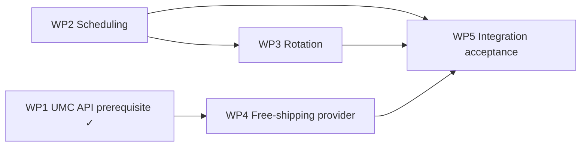

# M2 — Scheduling, Accessible Rotation, and Free-Shipping Provider

**Status:** FROZEN — PO APPROVED  
**Repository:** [magpern/universal-site-announcements](https://github.com/magpern/universal-site-announcements)  
**Plugin:** Universal Site Announcements (`universal-site-announcements`)  
**Namespace:** `USA\`  
**Parent architecture:** [MASTER_PLAN.md](MASTER_PLAN.md) (M0 frozen)  
**M1 baseline:** [M1_CORE_MANUAL_ANNOUNCEMENT_BAR.md](M1_CORE_MANUAL_ANNOUNCEMENT_BAR.md) / [m1-core-manual-announcement-bar.md](../closure/m1-core-manual-announcement-bar.md)  
**M1 completion SHA:** `34b3a36f84156a442636861790489a76e1220603`  
**Frozen:** 2026-08-23  

**UMC prerequisite:** **RESOLVED** — Universal Multicurrency **v1.2.0** public API verified (see §7).

---

## 1. Objective

Complete the planned M2 feature set:

- Scheduled manual announcements.
- Multiple active announcements with deterministic ordering.
- Accessible fade rotation with pause/resume.
- A dynamic WooCommerce free-shipping announcement that never invents a threshold.
- Truthful currency-aware threshold display through the Universal Multicurrency (UMC) public API `umc_get_free_shipping_threshold_display()`.

### Explicit non-goals

- Audience targeting, per-page targeting, analytics, campaign management.
- Geolocation or visitor-location determination.
- Elementor widgets or visual redesign of the host Store Notice bar.
- Cart free-shipping progress-bar fixes (other projects).
- Implementing or merging UMC API changes inside this repository.
- Mutating `woocommerce_demo_store`, `woocommerce_demo_store_notice`, shipping settings, or theme files.
- Instantiating UMC internal services, reading exchange rates, inspecting the `umc_currency` cookie for money math, or reconstructing converted thresholds.

---

## 2. Audited baseline (read-only)

### 2.1 USA M1 architecture

| Component | Behaviour relevant to M2 |
|-----------|--------------------------|
| `StoreNoticeRenderer` | Filters `woocommerce_demo_store` at priority 20; enable gate; single-message selection via `Selector::first_content()` |
| `ContentReplacer` | Preserves the upstream opening `<p>` fragment; strips only `display:none`; replaces inner HTML only |
| Outer contract | `<p class="woocommerce-store-notice demo_store" …>` including theme attributes such as `data-position` |
| Pause control constraint | A `<button>` must **not** be nested inside the Store Notice `<p>` |

### 2.2 Free-shipping configuration (reference site)

| Item | Finding |
|------|---------|
| Free Shipping method | Enabled; `requires=min_amount`; positive `min_amount`; `ignore_discounts=yes` |
| Default country | Store default country resolves into the configured free-shipping zone |
| Base currency | Store base currency |

### 2.3 Eligibility and related hooks (reference site)

| Hook | Active callbacks (audit snapshot) |
|------|-----------------------------------|
| `woocommerce_shipping_free_shipping_is_available` | Only UMC `ShippingConversion::filter_free_shipping_availability` |
| `woocommerce_package_rates` | UMC rate conversion |
| `woocommerce_cart_shipping_packages` | UMC currency package-cache isolation |
| Cart progress subtotal filters (host/promotions) | Do **not** alter WooCommerce free-shipping availability |

**Implication:** A simple `min_amount` threshold claim can be truthful on this site when the displayed amount uses UMC’s checkout-aligned conversion path. Compatibility cannot be inferred for arbitrary future callbacks—see §6 eligibility gate.

### 2.4 Universal Multicurrency (verified v1.2.0)

| Item | Finding |
|------|---------|
| Release | **v1.2.0** (annotated tag → commit `a1fe8d842bfbc893e94cc45047a9a7e1f59b37e3`) |
| Public symbol | `umc_get_free_shipping_threshold_display( string $base_threshold ): ?array` |
| Documentation | `docs/HOOKS.md`, `docs/adr/0034-free-shipping-threshold-display-api.md`, `docs/architecture/free-shipping-threshold-display-api.md` |
| Implementation | `src/api.php` → `FreeShippingThresholdDisplayService` → shared `FreeShippingThresholdResolver` (same path as `ShippingConversion` eligibility) |
| Success shape | `formatted_html`, `amount`, `currency_code` |
| Failure | `null` (missing/invalid input, unbound service, non-convertible request, missing foreign rate, over-precision base input) |
| Consumer rule | Use `formatted_html` for presentation; do not convert, re-round, or rebuild formatting |

### 2.5 Caching / personalisation

| Item | Finding |
|------|---------|
| Object cache | Redis object cache present |
| Full-page HTML cache plugin | Not present |
| Edge HTML | Observed as dynamic (not treated as a safe anonymous shared cache for currency-varying HTML) |

**Requirement retained:** Before treating this server-rendered provider message as cache-safe under any future full-page or edge cache, that cache must correctly **vary or bypass** responses based on the active currency cookie (`umc_currency`). Acceptance must include currency-switch verification.

---

## 3. Milestone structure and sequencing



WP1 is complete. Scheduling, rotation, and provider proceed together in the M2 implementation branch.

---

## 4. Data model and administration

### 4.1 Schedule metadata (M2-only)

| Field | Storage | Admin |
|-------|---------|--------|
| `_usa_starts_at` | UTC instant (MySQL datetime UTC `Y-m-d H:i:s`) | Label **Starts at** — input and display in **WordPress site timezone** |
| `_usa_ends_at` | UTC instant | Label **Ends at (exclusive)** — input and display in site timezone |

**Save path:** Convert the administrator’s site-timezone datetime to UTC, then store UTC.

**Evaluation path:** Obtain `now` as a UTC instant; compare to stored UTC timestamps. Do **not** re-interpret stored values as site-local times during comparison.

**Inclusive calendar day help text:** For a notice active through all of 31 December, set **Ends at (exclusive)** to 1 January 00:00 in the site timezone (stored as the corresponding UTC instant).

Empty start = already started. Empty end = no end.

### 4.2 Active-state rule

An announcement is active when all of the following hold:

1. Post is `publish`.
2. `_usa_enabled` is true.
3. Schedule window: `(starts_at is empty OR now_utc >= starts_at_utc)` AND `(ends_at is empty OR now_utc < ends_at_utc)`.
4. Source is `manual` with non-empty sanitised content, **or** source is `woocommerce_free_shipping` and the provider successfully resolves a message (otherwise the provider row contributes nothing to the active list).

### 4.3 Priority

- Ordering: `_usa_priority` ascending, then post `ID` ascending.
- **Administration:** The announcement editor and list UI must support viewing, editing, and validating priority (integer; default 10; reject invalid non-numeric input).

### 4.4 Source types

| `_usa_source` | Front-end content |
|---------------|-------------------|
| `manual` | Sanitised `post_content` (existing M1 allowlist) |
| `woocommerce_free_shipping` | Generated at render time; editor body unused / hidden |

### 4.5 Provider announcement administration

- Create via admin as source type “WooCommerce free shipping” (or equivalent control).
- Title is admin-only.
- Enable/disable and priority same as manuals.
- Schedule fields apply the same UTC rules (provider may be scheduled).
- Preview/diagnostic panel shows: resolved reference country/zone, qualifying method, base `min_amount`, whether UMC API is available, and last suppression reason if any.
- Manual rich content remains separate; no mixing of manual body into provider output.

### 4.6 Provider uniqueness

At most **one** announcement with `_usa_source=woocommerce_free_shipping` and `_usa_enabled=true` may exist at any time, **regardless of schedule state**. Save-time validation blocks a second enabled provider post and surfaces an admin error. This prevents accidental future schedule overlap between two provider rows.

### 4.7 Capability, sanitisation, migration

- Capability: `manage_options` via `usa_manage_cap`; nonces on all writes.
- Manual content: existing `wp_kses` allowlist; `_blank` → `noopener noreferrer`.
- Provider `{amount}` HTML: narrow price allowlist (`span`, `bdi`, `class`, etc.).
- Migration: existing M1 posts gain empty schedule (always-on) and `manual` source; no WooCommerce option writes.

---

## 5. Rotation and rendering seam

### 5.1 Selection

- Build ordered active list (priority ASC, ID ASC).
- Zero active → empty string (no bar), same as M1 ownership rules.
- One active, or no-JS, or `prefers-reduced-motion` → render **only** the highest-priority message inside the preserved `<p>`; no rotation script; no pause button.

### 5.2 Multi-message JS path

- Inner HTML: `<span class="usa-announcement-bar__message">` siblings; first marked active.
- Fade: restrained opacity transition (~8 s visible / ~600 ms fade).
- **No `aria-live`** on automatic rotations.
- Pause/resume: visible keyboard-operable `<button>`; `aria-pressed`; state in `sessionStorage`.
- Pause when `document.visibilityState` is hidden.
- Hover/focus-within pause is supplementary only.
- Enqueue USA CSS/JS only when the multi-message JS path is active.

### 5.3 Pause-control shell (layout-safe)

After a successful M1-style paragraph splice (preserve opening-tag fragment; strip only `display:none`):

```html
<div class="usa-announcement-shell">
  <p class="woocommerce-store-notice demo_store" …>…message spans…</p>
  <button type="button" class="usa-announcement-bar__toggle" aria-pressed="false">…</button>
</div>
```

Requirements:

- Shell does **not** carry `woocommerce-store-notice` / `demo_store` classes.
- Host styles continue to apply to the full-width `<p>`; the shell must **preserve** the notice bar’s existing full-width appearance.
- The pause button is positioned independently (for example overlay or adjacent) and must **not** compress, shrink, or restyle the notice bar.
- Acceptance: desktop and mobile widths verify bar width/appearance parity with M1 single-message layout.

Do not rebuild the outer `<p>` from an attribute map.

---

## 6. WooCommerce free-shipping provider

### 6.1 Authoritative source

Read enabled Free Shipping methods for a **reference package**. Default destination: WooCommerce default country. Advanced filter: `usa_free_shipping_reference_package`.

USA never stores a duplicate threshold and never reimplements checkout eligibility.

### 6.2 When to generate the default message

Generate `Free shipping on orders of {amount} or more` only when **all** hold:

1. WooCommerce is available.
2. Reference package resolves to at least one Free Shipping method with `requires=min_amount` and positive numeric `min_amount`.
3. Qualifying methods do not conflict on `min_amount` (zero → suppress; one → use it; many with same amount → use that amount; many with differing amounts → suppress).
4. Eligibility gate passes (§6.3).
5. UMC public API returns a non-null display result for the base threshold (§6.4).

Suppress (no visitor-facing claim) for: WooCommerce unavailable; absent qualifying zone/method; `requires` in `{coupon, either, both, ''}`; conflicting thresholds; failed eligibility gate; UMC plugin missing; older UMC without the public function; API returns `null`.

### 6.3 Eligibility gate (concrete)

A runtime callback inventory **cannot** decide semantic compatibility of arbitrary code. Therefore:

1. Maintain an **explicit allowlist** of known-compatible callbacks on `woocommerce_shipping_free_shipping_is_available`. The audited compatible callback is `UMC\Integration\ShippingConversion::filter_free_shipping_availability`.
2. If **any other** callback is registered on that hook, **suppress** the provider.
3. Advanced integrator escape hatch: filter `usa_free_shipping_provider_eligibility_verified` may return true only for a deliberate, verified override after site-specific review.
4. Admin diagnostic must identify the relevant hook and callback category (for example “non-allowlisted callback on `woocommerce_shipping_free_shipping_is_available`”).

Cart-progress-only filters that do not register on the WC availability hook do not by themselves fail this gate.

### 6.4 Currency display and UMC (authoritative consumer contract)

| Condition | Provider behaviour |
|-----------|-------------------|
| `function_exists( 'umc_get_free_shipping_threshold_display' )` is false | **Suppress** (UMC missing or pre-1.2.0). Do **not** fall back to `wc_price( base )`. |
| API returns `null` | **Suppress**. Do **not** guess or show unconverted base threshold. |
| API returns three-key array | Render configured template using **`formatted_html` unchanged** (after narrow price `wp_kses`). Do not re-convert, re-round, or rebuild money formatting. |

USA is a public-API consumer only. It must not instantiate UMC internals, call `PriceConversionService`, inspect rates, read `umc_currency` for arithmetic, or duplicate `ShippingConversion` logic.

`amount` / `currency_code` may be used only as documented (diagnostics / non-presentation); presentation uses `formatted_html`.

Default template filter: `usa_free_shipping_message_template`.

---

## 7. UMC prerequisite verification (WP1 — COMPLETE)

### 7.1 Verified release

| Field | Value |
|-------|-------|
| Version | **1.2.0** |
| Tag | `v1.2.0` (annotated) |
| Release commit SHA | `a1fe8d842bfbc893e94cc45047a9a7e1f59b37e3` |
| Public symbol | `umc_get_free_shipping_threshold_display( string $base_threshold ): ?array` |
| Docs | `docs/HOOKS.md` § Public PHP API; ADR-0034; `docs/architecture/free-shipping-threshold-display-api.md` |
| Facade | `src/api.php` |
| Services | `src/PublicApi/FreeShippingThresholdDisplayService.php`, `src/Integration/FreeShippingThresholdResolver.php` |
| Tests | `tests/integration/FreeShippingThresholdDisplayApiTest.php` (parity with eligibility path) |

### 7.2 Contract consumed by USA

```php
$threshold = umc_get_free_shipping_threshold_display( $base_threshold_decimal_string );
// success:
// [
//   'formatted_html' => string,
//   'amount'         => string,
//   'currency_code'  => string,
// ]
// failure: null
```

Feature detection: `function_exists( 'umc_get_free_shipping_threshold_display' )`.

### 7.3 Sequencing

1. ~~Separate UMC plan freeze and implementation PR~~ — done (UMC v1.2.0).
2. ~~UMC API merged and verified~~ — done (this freeze).
3. USA work packages 2–5 consume the API.

**This USA milestone does not modify UMC.**

---

## 8. Ordered work packages

### WP1 — UMC prerequisite verification and dependency handoff — DONE

Verified against released UMC v1.2.0 source and docs. Provider unblocked.

### WP2 — Scheduling and active-announcement resolution

**Scope:** Schedule meta + admin labels; UTC save/compare; priority edit/validate in list and editor; extend Repository/Selector to return ordered active list; schedule-aware active rule.  
**Exclusions:** Rotation JS; provider.  
**Dependencies:** M1 complete.  
**Files (expected):** `AnnouncementMetaBoxes`, `Repository`, `Selector`, new `ScheduleEvaluator`, list-table columns, unit tests.  
**Validation:** Exclusive-end boundaries; site-TZ input → UTC storage; DST transition fixtures; priority ordering.  
**Stop:** Ambiguous timezone conversion or broken M1 always-on migration.

### WP3 — Rotation rendering, accessibility, and assets

**Scope:** Multi-span inner HTML; layout-safe shell + pause button; CSS/JS enqueue rules; reduced-motion / no-JS paths; preserve M1 outer `<p>` contract.  
**Exclusions:** Provider.  
**Dependencies:** WP2 active list.  
**Files (expected):** `StoreNoticeRenderer`, `ContentReplacer` helpers, `assets/css|js`, integration tests for shell markup and `data-position`.  
**Validation:** Desktop/mobile full-width bar preserved; pause keyboard + sessionStorage; no aria-live; single message = no script.  
**Stop:** Shell compresses or restyles the notice bar.

### WP4 — WooCommerce free-shipping provider and diagnostics

**Scope:** Reference package resolution; requires matrix; uniqueness; eligibility allowlist gate; UMC API consumer; admin preview/diagnostics.  
**Exclusions:** Scheduling/rotation already delivered; UMC implementation.  
**Dependencies:** WP1 green; WP2 for schedule on provider posts.  
**Files (expected):** `WooCommerceFreeShippingProvider`, eligibility gate, diagnostics, admin source UI, tests.  
**Validation:** Suppression matrix; allowlist behaviour; UMC API required; no base `wc_price` fallback.  
**Stop:** Non-allowlisted eligibility callback without verified escape hatch; API unavailable.

### WP5 — Cross-repository integration acceptance and closure

**Scope:** Full acceptance matrix; currency re-discovery; currency-switch / cache notes; M1 rollback intact; closure document; version bump **0.1.0 → 0.2.0**.  
**Exclusions:** M3+ features; production release tag unless separately requested.  
**Dependencies:** WP2–WP4; UMC API on target for provider rows.  
**Validation:** See §9.  
**Stop:** Any failed truthfulness or a11y acceptance item.

---

## 9. Test and acceptance strategy

### Automated

- Schedule: exclusive end; UTC compare; site-TZ save round-trip; DST transition cases.
- Priority ordering and admin validation.
- Active list with mixed scheduled/unscheduled posts.
- ContentReplacer + shell: `data-position` retained; pause button outside `<p>`; full-width regression fixtures where practical.
- Provider: `requires` matrix; conflicting thresholds; non-allowlisted callback suppression; uniqueness regardless of schedule.
- UMC API available + valid → provider can render.
- UMC missing / old UMC / API `null` → provider suppressed safely; other announcements still work.
- Base and foreign: `formatted_html` used unchanged.
- USA performs no rate multiplication, monetary rounding, UMC internal inspection, or reconstructed money formatting.
- Scheduling/rotation independent of provider availability.
- JS unit (or equivalent): pause state; reduced-motion; no aria-live on tick.

### Manual / DEV acceptance

| Scenario | Expected |
|----------|----------|
| Schedule through 31 Dec inclusive | Ends at exclusive 1 Jan 00:00 site TZ |
| Two+ active messages | Fade + pause; bar full-width on desktop and mobile |
| No JS / reduced motion | Highest-priority only; no pause control |
| Provider + each live-enabled UMC currency | Amount matches checkout free-shipping boundary |
| Currency switch | Announcement amount updates; no stale wrong-currency HTML under current cache posture |
| Disable USA / deactivate plugin | M1 rollback behaviour intact; WC options untouched |
| Second enabled provider save | Blocked with admin error |
| UMC API unavailable | Free-shipping announcement suppressed; manuals rotate normally |

---

## 10. Risk register

| Risk | Mitigation |
|------|------------|
| DST / timezone errors | UTC storage and UTC comparison only |
| Shell breaks full-width bar | Layout requirement + desktop/mobile acceptance |
| Arbitrary eligibility callbacks | Allowlist + suppress + escape hatch |
| UMC API unavailable at runtime | Fail closed for provider only |
| Future edge cache | Vary/bypass on `umc_currency` before calling cache-safe |
| Duplicate provider schedules | Uniqueness ignores schedule |

---

## 11. Architecture decisions

**No open PO decisions.**

| Topic | Decision |
|-------|----------|
| Schedule time model | Site TZ input/display; UTC store and compare |
| Eligibility compatibility | Allowlist UMC callback; suppress other hooks; verified escape hatch |
| Threshold display | UMC public API required; no `wc_price(base)` fallback |
| Provider uniqueness | At most one enabled provider, schedule-independent |
| Pause shell | Sibling outside `<p>`; must not alter bar full-width look |

---

## 12. Document history

| Version | Date | Notes |
|---------|------|-------|
| 0.1-draft | 2026-08-23 | Initial M2 draft for PO approval |
| 1.0-frozen | 2026-08-23 | Freeze: UMC v1.2.0 prerequisite verified; amend §6.4 to fail closed (no base `wc_price` fallback); WP1 complete |
