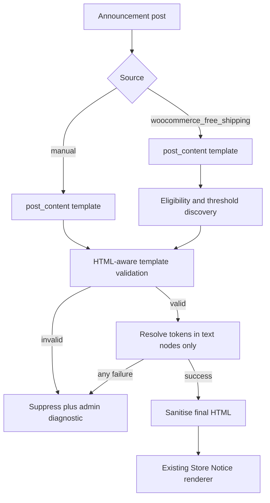

# M3 — Dynamic Message Templates

**Status:** FROZEN — PO APPROVED  
**Repository:** [magpern/universal-site-announcements](https://github.com/magpern/universal-site-announcements)  
**Plugin:** Universal Site Announcements (`universal-site-announcements`)  
**Namespace:** `USA\`  
**Parent architecture:** [MASTER_PLAN.md](MASTER_PLAN.md) (M0 frozen)  
**M1 baseline:** [M1_CORE_MANUAL_ANNOUNCEMENT_BAR.md](M1_CORE_MANUAL_ANNOUNCEMENT_BAR.md) / [m1-core-manual-announcement-bar.md](../closure/m1-core-manual-announcement-bar.md)  
**M2 baseline:** [M2_SCHEDULING_ROTATION_FREE_SHIPPING.md](M2_SCHEDULING_ROTATION_FREE_SHIPPING.md) / [m2-scheduling-rotation-free-shipping.md](../closure/m2-scheduling-rotation-free-shipping.md) / [m2-admin-discoverability-settings.md](../closure/m2-admin-discoverability-settings.md)  
**Planning baseline `main` SHA:** `2550580e22cff0e81caa8ee09a1758cb5bab152e`  
**Baseline version:** 0.2.1  
**Target implementation version:** 0.3.0  
**Frozen:** 2026-08-23  

---

## 1. Objective

Make announcement messages editable templates with controlled dynamic values (merge tags), resolved server-side at render time.

Authoring examples:

```text
Free shipping on orders of {{free_shipping_threshold}} or more
```

```text
Buy 2 {{product:123}} and get a free {{product:456}}
```

Product tokens render the current public product title as a safe link to the current public product URL. Surrounding promotional wording is editorial: Universal Site Announcements resolves product names and links only; it does not verify promotion configuration.

### Explicit non-goals

- Angle-bracket placeholders (for example `<shipping-threshold>`).
- WordPress shortcode execution.
- PHP evaluation, arbitrary options/meta lookups, user-supplied expressions, or “all WooCommerce fields” tokens.
- Product prices, stock, sale status, variants, quantities, cart actions, or promotion-rule validation.
- Targeting, analytics, Elementor widgets, design overhaul.
- Public third-party template filters or arbitrary token-registration hooks.
- Production deployment, release tag, or ZIP packaging as part of M3 planning.

---

## 2. Audited M2 baseline (read-only)

| Area | Current behaviour relevant to M3 |
|------|----------------------------------|
| Source model | `_usa_source` is `manual` or `woocommerce_free_shipping` |
| Manual content | Sanitised `post_content` with inline-link allowlist |
| Free-shipping provider | Eligibility allowlist gate; reference package; `requires=min_amount` only; uniqueness (one enabled provider) |
| Free-shipping message | Built at runtime via sprintf-style default; editor body unused for provider source |
| Threshold display | Public UMC function when available; M2 shipped fail-closed when API missing/null (no base `wc_price` fallback) |
| Rendering | Store Notice outer `<p>` preserved; schedule UTC; rotation settings; reduced-motion / no-JS / pause |
| Diagnostics | Provider diagnostic meta box; throttled render-failure notice |

**M3 intentionally revises** the free-shipping display contract to the hybrid UMC rules in §6 (distinguish UMC inactive vs UMC active-but-API-missing). Scheduling, rotation, outer markup, eligibility gate, and provider uniqueness remain.

---

## 3. Provider / template model

**Source type remains separate from token dependencies.**



### 3.1 `woocommerce_free_shipping` source

- Administrator edits `post_content` as the template (safe inline HTML + merge tags).
- Template **must contain exactly one** `{{free_shipping_threshold}}` (save-time validation and render-time enforcement).
- May include zero or more `{{product:ID}}` tokens.
- Still runs the M2 eligibility gate, reference-package resolution, `requires=min_amount` matrix, and one-enabled-provider uniqueness.
- Surrounding copy is editorial; monetary truth for the threshold comes only from the shipping / Universal Multicurrency path.
- Prevents a free-shipping source announcement from becoming arbitrary unverified marketing copy without the required threshold token.

### 3.2 `manual` source

- May use `{{product:ID}}` only.
- `{{free_shipping_threshold}}` is **forbidden** (save-time error; render-time suppress) so shipping claims cannot bypass the free-shipping source gate.

### 3.3 Duplicate-token policy

| Token | Policy |
|-------|--------|
| `{{free_shipping_threshold}}` | Exactly one required on free-shipping source; zero or two-or-more → invalid |
| `{{product:N}}` | Same ID may appear more than once (resolve each occurrence) |

### 3.4 Unresolved / invalid behaviour

Any invalid template, malformed token syntax, disallowed placement, unknown token, or failed token resolution **suppresses the whole announcement** and records an authorized-admin diagnostic. Never leave raw `{{…}}`, empty holes, guessed amounts, or fixed fallback amounts for failed shipping tokens.

---

## 4. Token grammar

Documented for administrators and developers.

- Delimiters: `{{` … `}}` only.
- Name: lowercase snake_case matching `[a-z][a-z0-9_]*`.
- Optional argument: `:` followed by a positive integer only (`{{product:123}}`).
- No nesting, no whitespace inside the braces, no expressions, no shortcodes, no PHP.
- **Malformed rule (locked):** any unmatched `{{` or `}}`, or any complete `{{…}}` that is not valid grammar, is invalid and **suppresses** the announcement. Literal brace syntax is **unsupported** in M3 (no escape language).

### 4.1 Initial catalogue (M3 only)

| Token | Meaning | Output |
|-------|---------|--------|
| `{{free_shipping_threshold}}` | Authoritative free-shipping minimum for the current context | Formatted price HTML |
| `{{product:ID}}` | Public WooCommerce product by numeric ID | Safe link: current public title → current public URL |

An internal token-provider registry may be designed for future extension. **M3 does not expose** a third-party template filter or arbitrary-token registration hook.

### 4.2 Placement rules (text nodes only)

- Tokens may appear only in **text content** and allowed inline formatting wrappers (for example `<strong>`, `<em>`).
- `{{product:ID}}` must **not** appear inside an existing `<a>` (the token itself renders a link).
- Tokens in attributes (`href`, `target`, `rel`, `style`, `class`, and any other attribute) are **rejected**.
- Shipping tokens may appear within normal text formatting such as `<strong>`.

### 4.3 HTML-aware validation pipeline (mandatory order)

1. **HTML-aware template validation** runs **before** token resolution. It must detect tokens in attributes (and other disallowed placements) and **reject** the template. Do not rely on later `wp_kses` to strip or alter attributes as the safety mechanism.
2. Resolve tokens **only** in validated text nodes.
3. **Sanitise the final rendered HTML** after token resolution (existing output / price allowlists).

---

## 5. Free-shipping threshold token

Resolution reuses the same discovery path as today’s free-shipping provider: reference package, qualifying `min_amount` methods, conflict detection, eligibility allowlist. The token returns the same authoritative display amount that checkout-aligned display uses when Universal Multicurrency supplies it.

### 5.1 Universal Multicurrency hybrid contract (locked)

`function_exists( 'umc_get_free_shipping_threshold_display' )` alone **cannot** distinguish “plugin absent” from “plugin active but too old for the API.”

**Canonical “UMC active” signal (audit):** Universal Multicurrency’s main plugin bootstrap defines `UMC_PLUGIN_FILE` (and `UMC_VERSION`) and loads `\UMC\Plugin` when the plugin is active. After `plugins_loaded`:

1. **Primary:** `defined( 'UMC_PLUGIN_FILE' ) && class_exists( \UMC\Plugin::class )`
2. **Optional admin cross-check:** `is_plugin_active( 'universal-multicurrency/universal-multicurrency.php' )`

| State | Behaviour |
|-------|-----------|
| UMC **not active** | Format base threshold with WooCommerce `wc_price()` in store base currency |
| UMC **active** and public API **missing** | Suppress announcement + diagnostic |
| UMC **active** and API returns `null` or invalid shape | Suppress + diagnostic |
| UMC **active** and API succeeds | Use sanitised `formatted_html` |

Never degrade a failed active-UMC case to a guessed or empty token. Never invent currency arithmetic inside Universal Site Announcements.

---

## 6. Product token

- ID is a positive WooCommerce product ID (not a slug).
- Render current public title as a safe link to the current public product URL.
- If WooCommerce is unavailable, or the product is missing, private, unpublished, or lacks a safe public URL → suppress the whole announcement + diagnostic.
- Renamed products and changed permalinks are picked up at render time (nothing persisted except the ID in the template).
- Out of scope: prices, stock, variations, quantities, cart actions, promotion validation.

---

## 7. Migration (non-destructive, versioned, idempotent)

| Rule | Behaviour |
|------|-----------|
| Schema marker | Persist a USA schema/version option (for example `usa_schema_version`) when M3 migration completes |
| Empty provider bodies only | For `_usa_source=woocommerce_free_shipping` with empty `post_content`, set default: `Free shipping on orders of {{free_shipping_threshold}} or more` |
| Non-empty bodies | **Never overwrite**, even if previously unused by M2 |
| Invalid legacy body | Non-empty provider content lacking exactly one required shipping token → admin-visible **invalid template** until corrected; front-end suppresses; not silently replaced |
| Manual posts | Unchanged |
| Old sprintf filter | Stop using `usa_free_shipping_message_template` as an authoring path; the default string may remain only as the migration seed constant |
| No new template filter | Do **not** add `usa_merge_tag_template` or similar in M3 |

---

## 8. Editor and administrator UX

### 8.1 Prominent source selector

Before the content editor, the administrator clearly chooses:

- Manual message  
- WooCommerce free shipping  

The dynamic-value picker then exposes **only** tokens allowed for that source.

### 8.2 Insert dynamic value

- Control beside or within the announcement editor.
- Lists only values available for the selected source context.
- Product selection opens a searchable WooCommerce product picker and inserts a stable `{{product:ID}}` at the cursor (administrators need not type numeric IDs).
- Human-readable token help and examples.

### 8.3 Preview / status panel

Shows:

- Rendered current message when resolvable  
- Each detected token  
- Token validity  
- Suppression reason / diagnostic when unresolved or invalid  

Disclaimer: claims such as “Buy 2 … get one free” are editorial copy. The plugin resolves product names/links only; it does not verify promotion configuration.

### 8.4 Diagnostics

Retain and extend free-shipping diagnostics with template/token validity (including invalid legacy templates). Authorized-admin only.

### 8.5 Product search security

- Product search/picker requires the Universal Site Announcements management capability.
- No public token-resolution endpoint that could leak unpublished products.

---

## 9. Security, compatibility, accessibility

- Strict merge-tag parser; no `do_shortcode`.
- Correct escaping by output context; product links and price HTML through existing narrow allowlists.
- Graceful WooCommerce / Universal Multicurrency absence per §5–§6.
- Unchanged: Store Notice outer-markup contract, schedule logic, rotation (including settings), reduced-motion, pause control, no-JavaScript fallback, disable/deactivate rollback.
- Never persist resolved shipping amounts, product names, URLs, or prices as a substitute for source data.

---

## 10. Ordered work packages (future implementation)

| WP | Scope |
|----|--------|
| WP1 | Schema option + non-destructive migration + invalid-legacy diagnostics |
| WP2 | Merge-tag parser + HTML-aware placement validation |
| WP3 | Token registry: free-shipping (hybrid UMC) + product link |
| WP4 | Wire templates into repository/render path; free-shipping source requires exact one threshold token |
| WP5 | Editor: prominent source, insert control, product picker, preview panel |
| WP6 | Tests, acceptance, docs closure; version 0.3.0 |

---

## 11. Test and acceptance strategy

### Automated

- Parser grammar: valid tags; unmatched braces; invalid complete expressions → suppress.
- Tokens in attributes → reject before resolution.
- `{{product:ID}}` inside existing `<a>` → reject.
- Tokens inside `<strong>` text → allowed (shipping and, where permitted, product).
- Manual static messages without tokens unchanged.
- Free-shipping token: base currency via `wc_price` when UMC not active; each enabled UMC currency when API succeeds; UMC active + API missing → suppress; API null/invalid → suppress.
- Product token: title + safe link; renamed product / changed permalink at render; missing/private/draft/invalid → suppress.
- Duplicate shipping token → invalid; duplicate product ID → allowed.
- Migration: empty body seeded; non-empty body untouched; schema version idempotent; invalid legacy visible in admin.
- Product picker authorization and search behaviour.
- Preview vs front-end parity for resolvable templates.
- Schedule / rotation / no-JS / reduced-motion regression.
- Deactivate / disable rollback unchanged.

### Manual / DEV (implementation milestone only)

- Edit free-shipping wording with required token; confirm amounts match checkout / UMC display.
- Insert products via picker; confirm links.
- Confirm attribute-injection attempts fail closed.
- Restore disposable fixtures after testing.

---

## 12. Risk register

| Risk | Mitigation |
|------|------------|
| Treating API absence as “UMC inactive” | Canonical active signal before API check |
| kses “fixing” attribute tokens | HTML-aware validation rejects before resolve |
| Overwriting merchant-edited empty-looking content | Migrate only truly empty bodies; version gate |
| Product token nested in links | Explicit placement reject |
| Second template-authoring path | No public template/token hooks in M3 |

---

## 13. Architecture decisions

**No open PO decisions.** Locked for this draft:

| Topic | Decision |
|-------|----------|
| Source vs tokens | Source remains; tokens constrained by source |
| Free-shipping template | Exactly one `{{free_shipping_threshold}}` |
| UMC hybrid | Not active → `wc_price(base)`; active + API missing/null/invalid → suppress; success → `formatted_html` |
| UMC active signal | `UMC_PLUGIN_FILE` + `\UMC\Plugin` (not `function_exists` alone) |
| Migration | Empty-only, versioned, non-destructive |
| Malformed braces | Suppress; no literal-brace support |
| Placement | Text nodes only; HTML-aware validation before resolve; sanitise after |
| Extension hooks | Internal registry design only; no public template/token hooks in M3 |
| Source UX | Prominent selector before content editor |

---

## 14. Document history

| Version | Date | Notes |
|---------|------|-------|
| 0.1-draft | 2026-08-23 | Initial M3 draft for PO approval |
| 1.0-frozen | 2026-08-23 | Freeze — PO approved; HTML-aware validation and hybrid UMC locked |
