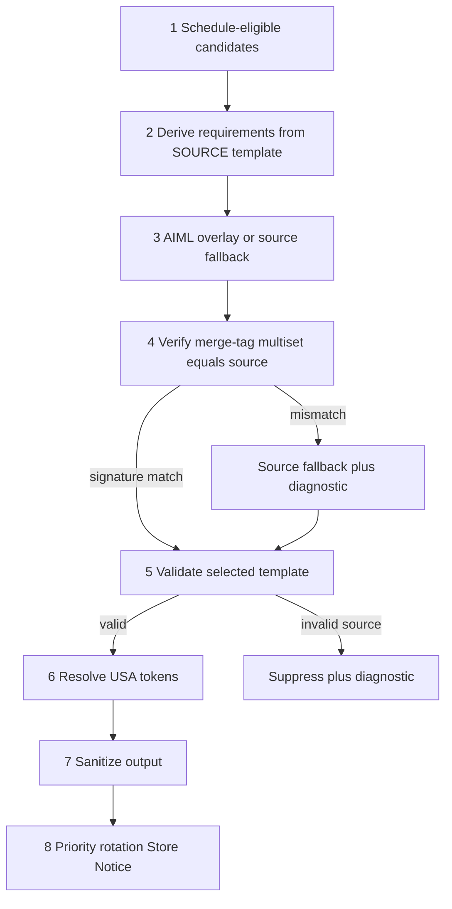
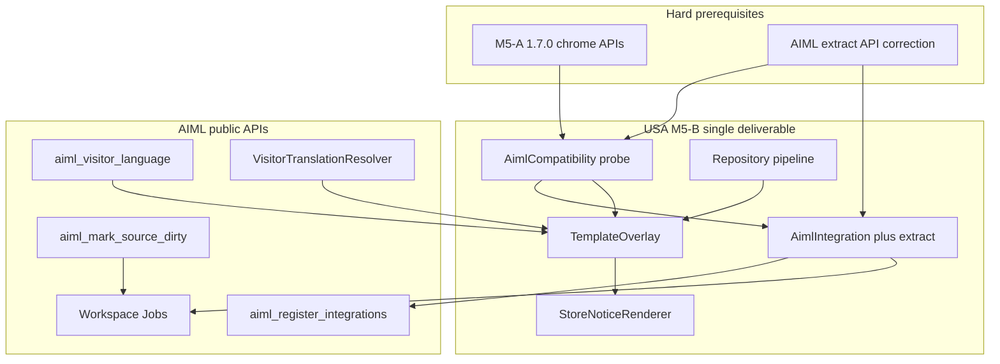

# M5-B — AIML Template Overlays

**Status:** FROZEN — PO APPROVED  
**Repository:** [magpern/universal-site-announcements](https://github.com/magpern/universal-site-announcements)  
**Plugin:** Universal Site Announcements (`universal-site-announcements`)  
**Namespace:** `USA\`  
**Parent plan:** [M5_MULTILINGUAL_ANNOUNCEMENT_TEMPLATES.md](M5_MULTILINGUAL_ANNOUNCEMENT_TEMPLATES.md) (M5 frozen)  
**Related prerequisite:** AI Multilingual (`magpern/ai-multilingual`) — Integration / Extension public APIs only  
**Planning baseline `main` SHA:** `a8f3b7ba4195c20dd1de204efb1e00940158a768`  
**Baseline version:** 0.4.1  
**Expected implementation version:** **0.5.0**  
**Frozen:** 2026-08-24

---

## 1. Objective

Implement an **optional USA adapter** that localizes the visitor-visible announcement template **body** through AIML while preserving all USA ownership and safety contracts from [M5_MULTILINGUAL_ANNOUNCEMENT_TEMPLATES.md](M5_MULTILINGUAL_ANNOUNCEMENT_TEMPLATES.md).

When AIML is absent, inactive, incompatible, unavailable, or not deployed, USA renders source templates exactly as it does today ([`Repository::get_active()`](../../src/Announcement/Repository.php)).

M5-B is a **single deliverable**: Integration registration, Workspace/Jobs extract, visitor overlay resolve, and source dirty invalidation. A runtime-only phase (overlay without extract) is **explicitly forbidden** — without public extraction support, operators cannot create or maintain announcement translations through AIML Workspace/Jobs.

### Explicit non-goals

- Translating title, schedules, weekly recurrence, enabled state, priority, rotation settings, legacy source metadata, free-shipping configuration, diagnostics, resolved prices, product links, or final rendered HTML.
- Changing scheduling, weekly recurrence, or schedule evaluation (M4).
- Changing source-inference UX (M3 / 0.4.1).
- Changing WooCommerce eligibility, Universal Multicurrency handling, or provider rules.
- Changing cache policy, targeting, analytics, Elementor, or production deployment/tag/ZIP workflows.
- Reimplementing AIML host/language mapping inside USA.
- Importing AIML internal Store, LanguageContext, Router, Jobs, Workspace, or other internal classes.
- Forking/vendoring AIML code or duplicating translations under page hosts.
- Publicizing `usa_announcement` REST, archives, permalinks, title, or undeclared fields.
- A second USA translation editor (translation work stays in AIML Workspace/Jobs).

---

## 2. Hard prerequisites and dependency gates

| Gate | Status | Blocks |
|------|--------|--------|
| AIML M5-A on `main` (1.7.0) | Done (merge `8955a1b5f55ec77675715fc93eddf8de5ffc6933`) | — |
| AIML extract API corrective release (M5-A.1 / 1.8.0) | Done (merge `980e463b73a59901dd50fc12b198c7f1813b0546`) | — |
| M5-A + extract API merged, documented, feature-probe verified, installed on target dev environment | Done (DEV bind-mount serves `AIML_VERSION=1.8.0`; probe confirmed `Contract::FORMAT_HTML` + `TranslationUnitDescriptor::from_source(...)`) | — |
| Formal AIML GitHub tag/release | Pending | Production / ZIP-based deployment only |
| This M5-B plan frozen | Done (this document) | — |

### DEV vs production gate (locked)

Following the M5 split posture:

- **Target development environment:** USA M5-B implementation may begin once AIML M5-A **1.7.0+** and the **extract API corrective release** are **merged on AIML `main`**, **documented**, **pass the USA feature probe**, and **installed on the target development environment** (dev bind-mount is sufficient).
- **Production / ZIP-based deployment:** Requires formal AIML GitHub tag/release for M5-A and the extract corrective release before production deploy.

Do **not** require a formal GitHub tag before USA M5-B DEV implementation starts. Do require merge + documentation + feature-probe verification + DEV install for both AIML prerequisites.

### Locked rule — no runtime-only phase

M5-B must ship registration + extract + overlay + dirty invalidation together. Without extract, there is no usable multilingual feature.

---

## 3. AIML extract API prerequisite (hard blocker)

### 3.1 Gap

`AIMultilingual\Integration\TranslationUnitDescriptor` (public Integration API) requires `source_hash` and `text_format` constructor arguments. Integration API v1 currently documents identity, compatibility, and chrome admission — but does **not** publish:

- A public helper to compute `source_hash`
- Integration-owned `text_format` vocabulary constants (e.g. documented `html`)

`AIMultilingual\Integration\Contract` exposes identity, ownership, and compatibility constants only.

Existing AIML integrations compute hashes via internal Store classes. USA **must not** import Store or calculate an undocumented hash algorithm itself.

### 3.2 Required AIML corrective API (generic; separate AIML task)

Before USA M5-B implementation, AIML must ship a small generic corrective release providing **at least**:

1. **Documented HTML format support** — a public Integration API constant or equivalent (e.g. on `Integration\Contract`).
2. **Public source-hash helper or descriptor factory** — e.g. `source_hash( string $text, string $format ): string` and/or a factory that accepts source text + format and returns a valid `TranslationUnitDescriptor` without Store imports by the consumer.

Exact symbol names are defined by the AIML corrective release documentation. USA consumes only what AIML publishes.

### 3.3 Stop condition

Do **not** implement USA M5-B until the extract corrective release is:

- Merged on AIML `main`
- Documented in AIML Integration API docs
- Verified by USA feature probe on the target development environment
- Installed on the target development environment

Formal GitHub tag is **not** required to start DEV implementation; it **is** required before production/ZIP deploy.

See also parent M5 stop conditions in [M5_MULTILINGUAL_ANNOUNCEMENT_TEMPLATES.md](M5_MULTILINGUAL_ANNOUNCEMENT_TEMPLATES.md) §16.

---

## 4. Public AIML contract audit

Authority: AIML merge `8955a1b5f55ec77675715fc93eddf8de5ffc6933` (1.7.0), public docs `INTEGRATION_API_V1.md`, `EXTENSION_API_V1.md`, `HOOKS.md`, ADR-0025, and M5-A closure `M5A_PRIVATE_CPT_CHROME_INTEGRATION_CLOSURE.md` in the AIML repository.

USA consumes **public AIML APIs only**.

### 4.1 Integration registration (`aiml_register_integrations`)

| Symbol | Namespace | Role |
|--------|-----------|------|
| `PluginIntegrationInterface` | `AIMultilingual\Integration\` | Required base integration |
| `DeclaresChromeOwnedSurfaces` | `AIMultilingual\Integration\` | Optional companion interface (1.7.0) |
| `ChromeOwnedSurfaceDeclaration` | `AIMultilingual\Integration\` | Sealed declaration (`post_type`, owner types, fields, `integration_units_only`) |
| `PluginIdentity::build()` / `parse()` | `AIMultilingual\Integration\Identity\` | Immutable `p:` key grammar — never concatenate keys manually |
| `CompatibilityStatus` + `get_compatibility()` | `AIMultilingual\Integration\` | Lifecycle gate (`allows_overlay()`, `allows_operation()`) |
| `Contract::API_VERSION`, `Contract::OWNERSHIP_*` | `AIMultilingual\Integration\` | Public Integration constants |
| `TranslationUnitDescriptor` | `AIMultilingual\Integration\` | Extract unit DTO (requires hash + format via public helper/factory once corrective release ships) |
| Hook `aiml_register_integrations` | — | Registration hook |

**Chrome declaration lifecycle**

1. Register on `aiml_register_integrations`.
2. AIML collects declarations; validates **after CPT registration** (normally post-`init`).
3. Invalid declaration → disable **that** chrome-surface declaration + authorized diagnostic (`chrome_declaration_disabled`); continue other integrations.
4. Activated surfaces: Workspace/Jobs extract declared `p:` fields only (`integration_units_only`); no natives/blocks/Elementor/meta.
5. Visitor resolve uses Extension `VisitorTranslationResolver` — **not** `register_output_hooks` / FrontendBridge.

AIML does **not** flip CPT `public` / REST / rewrite / archives / permalinks.

### 4.2 Extension visitor resolve

| Symbol | Role |
|--------|------|
| `ExtensionServices::resolver(): ?VisitorTranslationResolver` | Public resolver accessor (documented M5-A consumer pattern) |
| `VisitorTranslationResolver::resolve( SourceSegmentReference, LanguageReference ): ?ResolvedTranslation` | Host-independent `p:` resolve |
| `SourceSegmentReference` | `( source_type, source_id, segment_key )` — segment keys unique within source object |
| `LanguageReference` | URL language **code** only (not database language id) |
| `ResolvedTranslation` | `{ text, format, available }` — no Store row exposure |
| `aiml_visitor_language(): ?VisitorLanguageContext` | `{ code, is_default }` from AIML URL/host resolution |
| `aiml_mark_source_dirty( string $source_type, int $source_id ): bool` | Request-local dirty; shutdown sync remains sole sync authority |

**Extension-strict chrome eligibility (all resolve to `null`; opaque to consumer)**

| Condition | Public result |
|-----------|---------------|
| Eligible: source `post_status=publish`, translation publication-eligible, non-stale, renderable status, valid identity/admission, non-default language | `ResolvedTranslation` |
| Missing translation | `null` |
| Unpublished / not publication-eligible | `null` |
| Stale | `null` (Extension-strict; not FrontendBridge I7) |
| Source not `publish` | `null` |
| Source missing / not admitted / invalid identity / overlay-disallowed integration | `null` |
| Default-language request or target is default | `null` |
| `aiml_visitor_language()` unavailable or too early | USA uses source template (overlay path not entered) |

**`aiml_visitor_language()` behaviour**

- Returns `{ code, is_default }` from AIML URL/host resolution (ADR-0024).
- Returns `null` when unavailable or too early (before request language context is established).
- Does **not** read cookies, geo, or `Accept-Language`.

### 4.3 Extract corrective API symbols (AIML 1.8.0 / M5-A.1)

USA feature probe verifies:

| Probe | Purpose |
|-------|---------|
| `defined( \AIMultilingual\Integration\Contract::class . '::FORMAT_HTML' )` / `Contract::FORMAT_HTML` | Public HTML format constant |
| `defined( \AIMultilingual\Integration\Contract::class . '::FORMAT_PLAIN' )` / `Contract::FORMAT_PLAIN` | Public plain format constant |
| `method_exists( \AIMultilingual\Integration\TranslationUnitDescriptor::class, 'from_source' )` | Public descriptor factory |

Do **not** import `AIMultilingual\Translation\Store`.

### 4.4 Explicit forbidden imports

USA must **not** import or call:

- `AIMultilingual\Translation\Store` and Store repositories
- `AIMultilingual\Language\LanguageContext` (internal)
- `AIMultilingual\Routing\Router`
- Jobs / Workspace internal service classes
- `IntegrationAdmissionRegistry` (internal wiring)
- `IntegrationFrontendBridge` / host-bound overlay path for site-wide chrome
- Manual Store reads/writes

---

## 5. Locked integration identity

Frozen in [M5_MULTILINGUAL_ANNOUNCEMENT_TEMPLATES.md](M5_MULTILINGUAL_ANNOUNCEMENT_TEMPLATES.md) §7 — not open for re-decision.

| Constant | Locked value |
|----------|--------------|
| `integration_id` | `universal_site_announcements` |
| `post_type` | `usa_announcement` |
| `owner_type` | `announcement` |
| `field` | `body` |
| Segment key | `PluginIdentity::build( 'universal_site_announcements', 'announcement', (string) $post_id, 'body' )` |
| Extract source | `post_content` only (not `post_title` or meta) |
| `text_format` | HTML (via public Integration API constant once corrective release documents it) |
| `ownership_class` | `Contract::OWNERSHIP_RECORD` |
| `register_output_hooks` | Intentionally empty — chrome uses Extension resolver |
| `get_api_version()` | `Contract::API_VERSION` (`v1`) |
| MIN_AIML_VERSION | `1.7.0` |

---

## 6. Compatibility gate and M5-A feature probe

USA `AimlCompatibility` (or equivalent) must pass **both** before registration **and** before runtime resolve (re-check at render time):

### 6.1 Version check

- `defined( 'AIML_VERSION' )` and `version_compare( AIML_VERSION, '1.7.0', '>=' )`

A version string alone is **not** sufficient.

### 6.2 M5-A symbol probe

| Probe | Purpose |
|-------|---------|
| `class_exists( \AIMultilingual\Integration\DeclaresChromeOwnedSurfaces::class )` | M5-A companion interface |
| `class_exists( \AIMultilingual\Integration\ChromeOwnedSurfaceDeclaration::class )` | Declaration value object |
| `class_exists( \AIMultilingual\Extension\VisitorTranslationResolver::class )` | Host-independent resolver |
| `class_exists( \AIMultilingual\Extension\VisitorLanguageContext::class )` | Language DTO |
| `class_exists( \AIMultilingual\Extension\SourceSegmentReference::class )` | Resolver input type |
| `class_exists( \AIMultilingual\Extension\LanguageReference::class )` | Language input type |
| `class_exists( \AIMultilingual\Extension\ResolvedTranslation::class )` | Resolver output type |
| `function_exists( 'aiml_visitor_language' )` | Public language helper |
| `function_exists( 'aiml_mark_source_dirty' )` | Public dirty helper |
| `method_exists( \AIMultilingual\Extension\ExtensionServices::class, 'resolver' )` | Public resolver accessor |

### 6.3 Extract corrective API probe (AIML 1.8.0)

| Probe | Purpose |
|-------|---------|
| `Contract::FORMAT_HTML` exists | Documented HTML format vocabulary |
| `Contract::FORMAT_PLAIN` exists | Documented plain format vocabulary |
| `method_exists( TranslationUnitDescriptor::class, 'from_source' )` | Valid descriptor construction without Store |

If **any** probe fails → treat AIML as incompatible: skip `aiml_register_integrations` registration; runtime overlay returns source-only.

---

## 7. USA runtime order (mandatory)

Refines parent M5 §9 with **source-authoritative requirements** and **protected merge-tag equivalence** between overlay and validation.

1. **Schedule gate** — USA selects schedule-eligible source announcements (`enabled` + schedule mode/window).
2. **Source requirements** — Derive template requirements from **source** `post_content` via `TemplateRequirements::analyse()`. Source requirements remain authoritative for free-shipping eligibility, uniqueness, and provider behaviour.
3. **Overlay** — For each candidate, obtain translated template through public AIML APIs or use source template fallback.
4. **Protected-token equivalence** — Verify overlay preserves the source template's protected merge-tag signature exactly (§8).
5. **Validation** — Validate the selected template with existing template rules (`TemplateRequirements`, placement, structure).
6. **Token resolution** — Resolve USA tokens via `TemplateEngine` on the selected template.
7. **Sanitization** — Sanitize output ([`StoreNoticeRenderer`](../../src/Rendering/StoreNoticeRenderer.php) `sanitize_output()` seam — no cache-policy change).
8. **Priority / rotation / render** — Existing priority sort, rotation selection, and Store Notice rendering.

Do **not** translate after token resolution. Do **not** run priority/rotation before overlay.

**Implementation seam (future):** Steps 1–6 in [`Repository`](../../src/Announcement/Repository.php) / new `TemplateOverlay` helper, called before [`TemplateEngine::render()`](../../src/Template/TemplateEngine.php). Step 2 always analyses **source** `post_content`, never the overlay alone, for `derived_source` and free-shipping candidacy.

---

## 8. Protected merge-tag equivalence (mandatory)

A translated template may change editorial copy and permitted HTML only. It must preserve the **exact merge-tag multiset** from the source template:

- Same token **names**
- Same token **arguments**
- Same **occurrence counts**

Comparison uses [`MergeTagParser`](../../src/Template/MergeTagParser.php) / `token_list` shape `{ name, arg }` from source vs overlay.

**Examples**

| Source | Overlay | Result |
|--------|---------|--------|
| One `{{free_shipping_threshold}}` | One `{{free_shipping_threshold}}` | Valid |
| `{{product:123}}` | `{{product:123}}` | Valid |
| `{{product:123}}` | `{{product:456}}` | **Invalid** — source fallback + diagnostic |
| Source has one FS token | Overlay adds second FS token | **Invalid** |
| Source has product token | Overlay removes product token | **Invalid** |

A syntactically valid translation with a different merge-tag multiset is **invalid**. USA must fall back to the valid source template and record authorized diagnostic `overlay_token_signature_mismatch`.

This prevents translated content from changing free-shipping dependency, product references, or provider eligibility.

---

## 9. Translatable field matrix (v1)

| Field | Class | M5-B |
|-------|--------|------|
| `post_content` (template body) | TRANSLATABLE | Yes — sole unit |
| `post_title` | NOT USER-VISIBLE | Out of scope |
| Schedule / weekdays / window / priority / enabled | STRUCTURAL | No |
| Legacy source sync meta | STRUCTURAL | No |
| Rotation / fade options | STRUCTURAL | No |
| Resolved threshold HTML / product link HTML | RUNTIME | No |
| Diagnostics | NOT USER-VISIBLE | No |

---

## 10. Adapter, extraction, dirty invalidation, discovery

### 10.1 Future USA files

| File | Role |
|------|------|
| `src/Integration/AimlIntegration.php` | `PluginIntegrationInterface` + `DeclaresChromeOwnedSurfaces` |
| `src/Integration/AimlCompatibility.php` | Version + feature probe |
| `src/Integration/TemplateOverlay.php` | Resolve, signature gate, fallback |
| [`Plugin.php`](../../src/Plugin.php) | Wire `aiml_register_integrations` when compatibility passes |
| [`Repository.php`](../../src/Announcement/Repository.php) | Overlay seam before token resolve |
| [`AnnouncementMetaBoxes.php`](../../src/Admin/AnnouncementMetaBoxes.php) | Body-only dirty hook |

### 10.2 `extract_for_post()`

- Post type `usa_announcement` only.
- Read `post_content`; skip empty/whitespace-only bodies.
- Build segment key via `PluginIdentity::build()` only.
- Construct `TranslationUnitDescriptor` via **public** hash helper or factory from extract corrective release — **never** Store imports.
- Return empty array when compatibility disallows operation.

### 10.3 Dirty invalidation (tightened)

Call `aiml_mark_source_dirty( 'post', $post_id )` **only when all of**:

- Hook: `save_post_usa_announcement` after **successful** save (no `WP_Error`)
- Not `DOING_AUTOSAVE`
- Not a revision (`wp_is_post_revision()` guard)
- `post_content` **actually changed** (compare previous content to incoming)
- Compatibility probe still passes
- Post type is `usa_announcement`

Must **not** dirty translations when unrelated schedule, priority, enabled, weekday, or other meta changes alone.

### 10.4 Discovery (non-destructive)

- No database migration; no rewrite of `post_content`.
- After adapter enable: existing published announcements become discoverable in AIML Workspace when operators with `edit_post` open them (`extract_for_post` on admitted CPT).
- No bulk auto-extract job in M5-B scope.
- No second USA translation editor.

---

## 11. Fallback, privacy, and cache contracts

| Condition | Behaviour |
|-----------|-----------|
| Eligible published non-stale translation | Localized body template |
| Default AIML language / `is_default` / `aiml_visitor_language()` null | Valid **source** template |
| Missing translation | Valid **source** template |
| Stale / unpublished / AIML-ineligible | Valid **source** template |
| Unavailable language context | Valid **source** template |
| AIML unavailable / incompatible / probe failure | Valid **source** template |
| Invalid overlay syntax, placement, or sanitizer rejection | Valid **source** template + diagnostic |
| Invalid overlay merge-tag signature | Valid **source** template + diagnostic `overlay_token_signature_mismatch` |
| **Invalid source template** | **Suppress** under existing USA diagnostics |

- One failed overlay must **not** affect unrelated announcements in the rotation pool.
- No language cookies, geo, `Accept-Language`, URL parsing, or host mapping in USA.
- **No cache-policy changes** in M5-B; localized output relies on existing AIML URL/host language architecture.

---

## 12. Workspace / operator journey

1. Edit source template in USA Announcements admin.
2. AIML Workspace discovers admitted **body** field (not title / permalink / REST).
3. Translate / review / publish via AIML Jobs.
4. Localized visitor request: schedule → source requirements → overlay or source → signature → validate → tokens → sanitize → priority/rotation → banner.

---

## 13. Test and acceptance plan (future)

### 13.1 Automated

- AIML absent / inactive / incompatible / probe failure → source unchanged; no registration
- Default language → source unchanged
- Eligible published non-stale translation → localized body
- Missing / stale / unpublished / ineligible / unavailable context → source fallback
- Exact merge-tag preservation (free-shipping threshold, product IDs)
- Valid-looking overlay with added, removed, duplicated, or altered token → source fallback + `overlay_token_signature_mismatch`
- Token resolution after overlay; UMC threshold and product links runtime-resolved
- Source requirements authoritative for free-shipping eligibility and uniqueness
- Sanitization after overlay and token resolve
- Multiple rotating announcements fall back independently
- Source body edit invokes `aiml_mark_source_dirty`; meta-only edit does **not**
- M1–M4 regression: Store Notice attributes, scheduling/weekly windows, source inference, rotation, reduced motion, no-JS, disable/deactivate rollback
- No cookie / geo / Accept-Language / USA host-language mapping

### 13.2 Target development environment acceptance

- AIML 1.7.0+ and extract corrective release installed via dev bind-mount
- End-to-end Workspace/Jobs flow: translate one announcement body in AIML; verify visitor overlay on non-default language URL
- Verify `usa_announcement` REST/archive/permalink visibility unchanged

Black-box against published AIML public APIs only.

---

## 14. Architecture

---

## 15. Explicit exclusions

- AIML API changes within the USA M5-B task (extract correction is a **separate AIML release**).
- Runtime-only M5-B delivery.
- Generic token expansion beyond existing USA grammar.
- Translated admin labels / titles.
- Product price/stock/cart/promotion validation changes.
- Scheduling or source-inference changes.
- WooCommerce / UMC policy changes.
- Cache redesign.
- Production release, tag, ZIP, or deploy as part of M5-B planning or implementation authorization.

---

## 16. Work-package sequence

1. **Done:** M5 parent plan frozen; M5-A implemented on AIML `main` (1.7.0).
2. **Done:** This M5-B plan frozen (this document).
3. **Done:** AIML extract API corrective release (M5-A.1 / 1.8.0) — `Contract::FORMAT_*` + `TranslationUnitDescriptor::from_source(...)`; DEV feature probe green on bind-mount.
4. **Next (USA):** Implement M5-B adapter (expected **0.5.0**) on target development environment.
5. **Later:** Formal AIML + USA releases/tags for production/ZIP deploy.

---

## 17. Remaining PO / process decisions

| Decision | Notes |
|----------|-------|
| Authorize formal AIML GitHub releases (M5-A + M5-A.1) | Required before production/ZIP deploy only |
| Authorize USA 0.5.0 implementation | Unblocked — AIML prerequisites satisfied on target DEV |

Identity constants are locked (§5). This plan document is frozen.

---

## 18. Closure note

When M5-B ships, record a closure document under `docs/closure/` referencing this plan, the AIML M5-A release, the AIML extract corrective release, and the USA release SHA/version.
