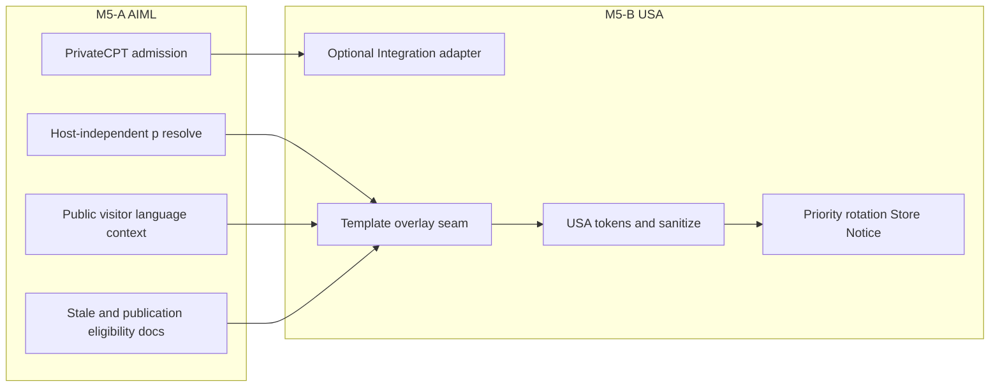
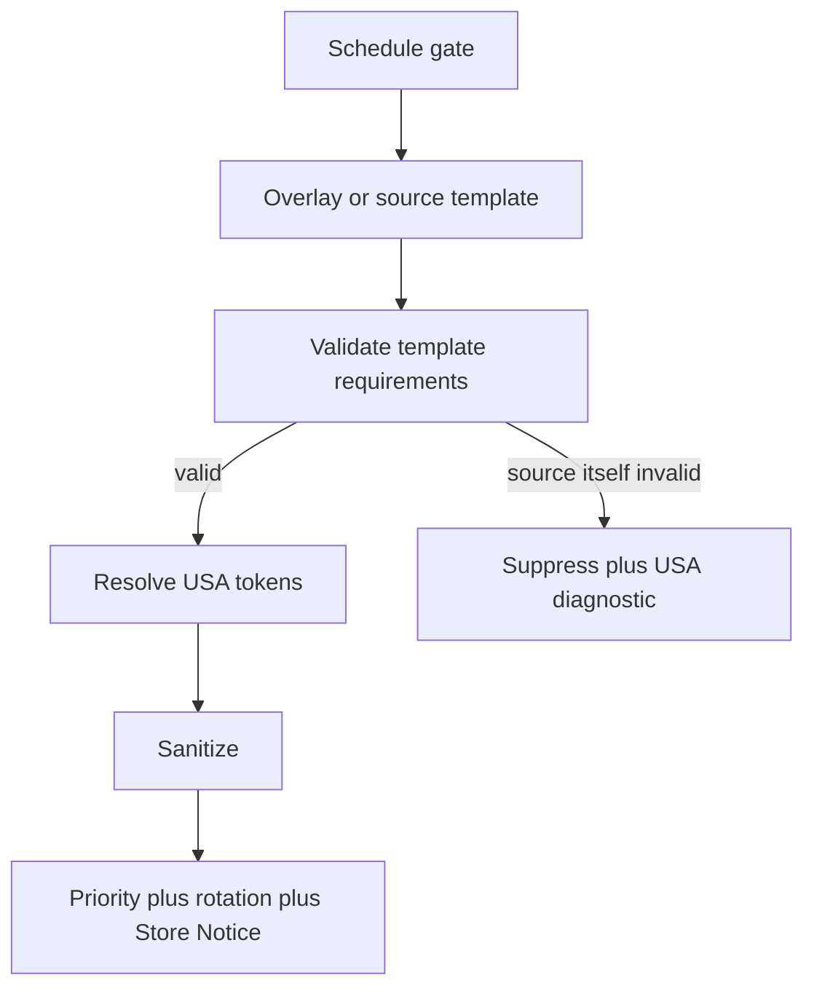

# M5 — Multilingual Announcement Templates

**Status:** FROZEN — PO APPROVED  
**Repository:** [magpern/universal-site-announcements](https://github.com/magpern/universal-site-announcements)  
**Plugin:** Universal Site Announcements (`universal-site-announcements`)  
**Namespace:** `USA\`  
**Parent architecture:** [MASTER_PLAN.md](MASTER_PLAN.md) (M0 frozen)  
**Related prerequisite:** AI Multilingual (`magpern/ai-multilingual`) — Integration / Extension public APIs only  
**Planning baseline `main` SHA:** `51816a771dd5b7b717bb973831ff2b6540888da3`  
**Baseline version:** 0.4.1  
**Expected M5-B implementation version:** **0.5.0** (future minor; after M5-A)  
**Frozen:** 2026-08-23

---

## 1. Objective

Deliver **localized announcement templates** when AI Multilingual (AIML) is available, while USA remains **fully functional with source templates** when AIML is absent, inactive, unsupported, or degraded.

M5 product goal is localized templates for site-wide announcement chrome. AIML API work is a **prerequisite work package**, not the product name.

### Explicit non-goals

- Changing scheduling, weekly recurrence, or schedule evaluation.
- Changing source-inference UX (derived template requirements, 0.4.1).
- Changing WooCommerce eligibility, Universal Multicurrency handling, or provider rules.
- Changing cache policy, targeting, analytics, Elementor, or production deployment/tag/ZIP workflows.
- Translating final rendered HTML, resolved threshold HTML, or product-link HTML.
- Reimplementing AIML host/language mapping inside USA.
- Using AIML private Store internals, forking/vendoring AIML code, or duplicating translations under page hosts.
- Publicizing `usa_announcement` REST, archives, permalinks, title, or undeclared fields.

---

## 2. Locked product split

M5 is explicitly split:

| Package | Owner | Role |
|---------|-------|------|
| **M5-A — AIML generic capability** | `magpern/ai-multilingual` | Prerequisite. Generic Integration/Extension public contract. |
| **M5-B — USA optional adapter** | `magpern/universal-site-announcements` | Optional consumer. Only after M5-A is frozen, released, documented, and tested. |

**Do not freeze or implement M5-B until the M5-A public API contract is frozen.**

**Immediate next task after this USA documentation freeze:** open a **separate AIML M5-A planning task**. No USA M5-B implementation may start before that prerequisite is released.

---

## 3. Architecture verdict (CASE B)

**CASE B — small generic AIML API gap.** Integration API v1 alone is not sufficient for correct site-wide announcement translation.

Confirmed constraints:

- USA cannot correctly use today’s host-bound overlay path for site-wide chrome.
- USA must not use AIML internal storage classes.
- USA must not duplicate translations under every page host.

Therefore M5-A must supply a generic, documented public contract before USA can adapt.

---

## 4. Ownership boundary

| Owner | Responsibilities |
|-------|------------------|
| **USA** | `usa_announcement` CPT; templates; scheduling; priority/rotation; providers; token grammar and resolution; sanitization; final banner render; source fallback; diagnostics |
| **AIML** | Language context from URL/host resolution; Store / Jobs / Workspace; Integration and Extension public APIs; translated overlay resolution; stale/publication eligibility for chrome consumers |
| **Adapter** | Lives in **USA**. Consumes only AIML **public** APIs. AIML remains **generic** (no USA-specific hardcoding in AIML core beyond declared integration admission). |

USA must use only AIML public APIs. It must not:

- Reimplement host/language mapping
- Import or call AIML private Store internals
- Fork or vendor AIML code
- Duplicate translations under page hosts as a workaround

---

## 5. Private-CPT constraints

`usa_announcement` is an **administrative / private** CPT. Its **body may be visitor-visible only through the Store Notice banner**. The post title is an admin label only.

AIML admission for this CPT **must not**:

- Make the CPT’s REST endpoint publicly readable as content
- Create public archives or permalinks for announcement posts
- Treat title or other undeclared fields as visitor-translatable overlays
- Broaden CPT visibility beyond admin plus the declared integration field

Admission covers **only** the declared integration-owned translation field (the announcement template body) for Workspace, Jobs, and public resolver contexts — not “make the CPT a public content type.”

---

## 6. M5-A — AIML generic capability (prerequisite)

Bounded, **generic** AIML Integration/Extension enhancements:

1. **Integration-owned private-CPT admission** limited to explicitly declared integration fields (evidence-gated; not “all public CPTs”).
2. **Host-independent public `p:` resolution** for those CPT-owned units so site-wide visitor chrome does not depend on the queried page host.
3. **Public visitor language-context contract** based on AIML’s URL/host resolution — expose or explicitly document how a consumer obtains the request’s resolved language code for public resolver types (e.g. `LanguageReference`). USA must not invent that mapping.
4. **Documented public stale and publication eligibility semantics** for chrome consumers (how missing, stale, unpublished, or otherwise ineligible overlays behave on the public resolve path).

M5-A is planned and released in the AIML repository. This USA document does not implement it.

**STOP for USA:** No M5-B freeze or implementation until M5-A’s public contract is frozen, released, documented, and tested.

---

## 7. M5-B — USA optional adapter (after M5-A only)

USA-only work consuming the frozen M5-A contract:

- Register an Integration API adapter from USA (`integration_id` expected: `universal_site_announcements`).
- Translate **only** `post_content` (authored template), **before** USA token resolution.
- Overlay via public language context + host-independent public `p:` resolve.
- Keep `{{free_shipping_threshold}}` and `{{product:ID}}` **literal** in translated storage; resolve only at USA runtime.
- Call public dirty/source-change helpers on template save as documented by AIML.
- Preserve existing schedule gate, template-requirements validation, sanitization, priority, rotation, and Store Notice rendering.

### Expected identity / extract sketch (informational; finalize against frozen M5-A)

| Item | Design |
|------|--------|
| Owner | `owner_type=announcement`, `owner_id=<post ID>`, `field=body` |
| Key | AIML public identity builder only |
| Format | HTML template with merge tags preserved structurally |
| Extract | When assembling the admitted announcement source object for Workspace |
| Runtime | Public resolver + public visitor language context from M5-A |

### Expected file touchpoints (M5-B implementation phase only)

Under `src/`: Integration adapter, compatibility gate, template overlay helper; wire in plugin bootstrap; seam in repository/content resolution **after** schedule gate and **before** token resolution; dirty on content save in announcement meta boxes. No AIML SDK fork or vendor copy.

---

## 8. Translatable field matrix (v1)

| Field | Class | M5-B |
|-------|--------|------|
| `post_content` (template body, including free-shipping provider templates) | TRANSLATABLE | Yes — sole unit |
| `post_title` | NOT USER-VISIBLE (admin label) | Out of scope |
| Schedule / weekdays / window / priority / enabled | STRUCTURAL | No |
| Legacy source sync meta | STRUCTURAL | No |
| Rotation / fade options | STRUCTURAL | No |
| Resolved threshold HTML / product link HTML | RUNTIME | No |
| Diagnostics | NOT USER-VISIBLE | No |

---

## 9. Unambiguous USA runtime order (M5-B)

1. **Schedule gate** identifies eligible announcements (`enabled` + schedule mode/window).
2. For each candidate, obtain the **AIML template overlay** or **source fallback**.
3. **Template-requirements validation** (`TemplateRequirements` / existing analyse path).
4. **USA token resolution** (`TemplateEngine`).
5. **USA sanitization**.
6. Existing **priority / rotation selection** and Store Notice rendering.

Do **not** translate after token resolution. Do **not** run priority/rotation before overlay. Selector/rotation operate on already-overlaid, validated, token-resolved, sanitized candidates (same relative order as today after content resolution).

---

## 10. Strict fallback contract

| Condition | Behaviour |
|-----------|-----------|
| Eligible published translation | Use translated template |
| Missing translation | Valid **source** template |
| Stale / unpublished / AIML-ineligible | Valid **source** template (per M5-A public eligibility) |
| Malformed or token-corrupt translation | Valid **source** template + USA diagnostic where applicable |
| AIML unavailable / degraded / unsupported | Valid **source** template |
| **Source template itself invalid** | **Suppress** the announcement under existing USA diagnostics |

One announcement’s translation failure must not break unrelated messages in the rotation set. AIML absence must not fatal; it must not empty the bar solely because AIML failed.

---

## 11. Provider, tokens, security, cache

- **Free shipping / product tokens:** Remain literal in translated storage; resolve only at USA runtime after overlay. Uniqueness and requirements continue to derive from the template (0.4.1 behaviour unchanged).
- **Security:** USA sanitization remains authoritative after token resolve. AIML does not own announcement HTML allowlists.
- **Visitor language:** From AIML public visitor language-context only. No language cookies, Accept-Language, or geo for anonymous visitors as a USA language source.
- **Cache:** M5 does **not** change cache policy. URL/host language authority remains AIML’s concern per its ADRs.

---

## 12. Workspace / operator journey (after M5-A + M5-B)

1. Edit the source template in USA Announcements admin.
2. AIML Workspace discovers the admitted **body** field for that announcement (not title / permalink / REST surface).
3. Translate / review / publish via existing AIML Jobs flows.
4. On a localized visitor request: USA schedule gate → overlay or source → validate → tokens → sanitize → priority/rotation → banner.

No second USA translation editor.

---

## 13. Test expectations (M5-B, after M5-A)

Black-box against published AIML public APIs only:

- AIML absent → source behaviour unchanged
- Default / source language → source template
- Eligible target language → translated template
- Missing / unpublished / stale-ineligible overlay → valid source
- Token preservation; corrupt translation → valid source + diagnostic
- Invalid source template → suppress + diagnostic
- `{{free_shipping_threshold}}` and `{{product:ID}}` resolve after translation
- Multi-announcement independent fallback
- Source edit dirties AIML source per public helper
- Sanitizer runs after overlay and token resolve
- Language obtained only via public AIML visitor language context
- No cookie / Accept-Language / geo language selection in USA
- No regression to scheduling, source-inference UX, Woo eligibility, UMC, or cache policy

---

## 14. Versioning and release posture

| Package | Version posture |
|---------|-----------------|
| USA baseline at this freeze | **0.4.1** (`51816a771dd5b7b717bb973831ff2b6540888da3`) |
| M5-B (USA) | Future minor, likely **0.5.0**, after M5-A is delivered |
| M5-A (AIML) | Its own AIML release; prerequisite for M5-B |

This freeze is **documentation only**. It does not change plugin version, create a tag/ZIP, deploy, or mutate any site.

---

## 15. Risks

| Risk | Notes |
|------|-------|
| M5-A contract scope | Medium — private-CPT admission + host-independent `p:` resolve + public language context + eligibility docs |
| M5-B once contract exists | Small–medium — thin USA adapter and overlay seam |
| Premature M5-B | High process risk — forbidden until M5-A is frozen/released/tested |
| Mis-admission of CPT | Must not publicize REST/archive/permalink/title |

---

## 16. Explicit stop conditions

Stop and do **not** proceed with USA M5-B implementation if any of the following hold:

1. M5-A public contract is not yet frozen, released, documented, and tested.
2. Proposed approach would translate resolved / final HTML instead of the authored template.
3. Proposed approach would reimplement host/language mapping in USA.
4. Proposed approach would import AIML private Store internals or vendor AIML code.
5. Proposed approach would duplicate translations under page hosts.
6. Proposed approach would publicize `usa_announcement` beyond the declared integration body field.
7. Proposed change would alter scheduling, weekly recurrence, source-inference UX, Woo eligibility, UMC handling, cache policy, targeting, or production deployment as part of “M5”.

---

## 17. Work-package sequence

1. **Done in this freeze:** USA M5 planning direction materialized and PO-approved as documentation.
2. **Next (required):** Separate **AIML M5-A** planning task (generic private-CPT admission, host-independent `p:` resolve, public visitor language context, stale/publication eligibility docs).
3. Freeze, implement, document, and test **M5-A** in AIML; publish the public contract.
4. Only then freeze and implement **M5-B** in this repository (expected **0.5.0**).

---

## 18. Closure note

When M5-B ships, record a closure document under `docs/closure/` referencing this frozen plan, the AIML M5-A release that satisfied the prerequisite, and the USA release SHA/version. Until then, this document is the authoritative USA M5 planning direction.
