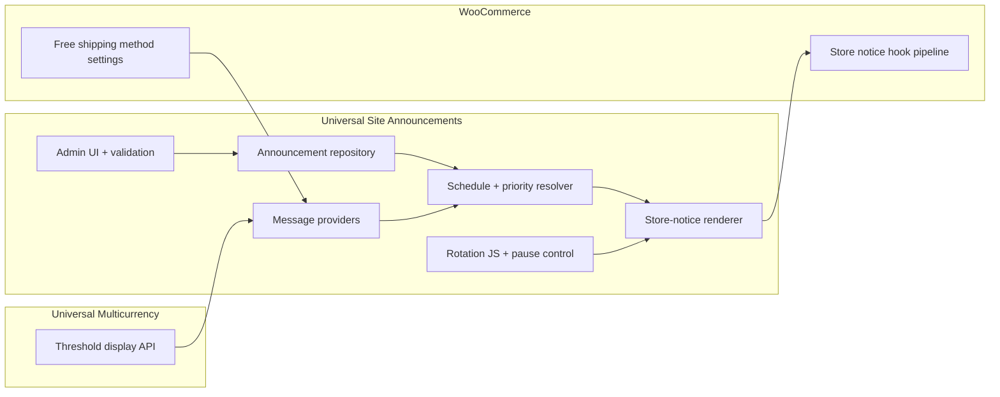

# Universal Site Announcements — Master Plan

**Status:** FROZEN — PO APPROVED  
**Repository:** [magpern/universal-site-announcements](https://github.com/magpern/universal-site-announcements)  
**Plugin name:** Universal Site Announcements  
**Text domain / slug:** `universal-site-announcements`  
**PHP namespace:** `USA\`  
**Frozen:** 2026-08-23 (M0)

---

## 1. Product objective

Build a small, generic WordPress plugin for a site-wide announcement bar that:

- Manages one or more announcement messages (manual content in M1; optional dynamic providers in M2).
- Supports safe inline links in message content.
- Integrates with the WooCommerce global Store Notice rendering seam on WooCommerce sites (preserving existing bar styling from the host theme and plugins).
- Adds scheduling, ordering, accessible multi-message rotation, and a WooCommerce free-shipping threshold provider in M2.

When active and enabled, the plugin owns **displayed** announcement content. When inactive or disabled, the original WooCommerce store-notice output returns unchanged.

### Non-goals

- WooCommerce shipping rule configuration or checkout eligibility logic.
- Currency conversion or exchange-rate rules (owned by Universal Multicurrency when present).
- Header, navigation, or page-builder template construction.
- Visitor geolocation or per-zone inference at browse time.
- Audience targeting, per-page rules, A/B testing, analytics, or campaign management.
- Mutating WooCommerce’s `woocommerce_demo_store` enable option (installation prerequisite only).
- HPOS compatibility declarations (plugin does not operate on orders; not applicable).
- Fixing unrelated site UI (for example, a separate cart progress bar that hardcodes a free-shipping threshold) — such defects are tracked in their owning projects.

---

## 2. Existing-state integration audit (sanitised)

Discovery on a reference WooCommerce site established the following integration facts. Mechanisms are described generically; no site-specific paths or branding appear in this document.

### 2.1 Announcement bar today

| Aspect | Finding |
|--------|---------|
| **Render mechanism** | WooCommerce global Store Notice: `woocommerce_demo_store()` hooked to `wp_body_open` (with theme-specific re-hooking). |
| **Message source** | Static WordPress option `woocommerce_demo_store_notice` (merchant-editable under WooCommerce site visibility settings). |
| **Enable gate** | Option `woocommerce_demo_store` = `yes` adds body class `woocommerce-demo-store` and triggers notice output. |
| **Host styling** | Existing theme and companion plugins supply CSS for `.woocommerce-store-notice.demo_store` (colours, in-flow layout, dismiss behaviour may be customised). |
| **DOM contract** | Outer element is `<p class="woocommerce-store-notice demo_store">` with complementary role/label attributes. |
| **Theme integration** | Blocksy (when active) filters `woocommerce_demo_store` to add `data-position` on the `<p>` element from a theme mod. |
| **Filter order** | Host plugins typically filter at priority 10; USA must run later (priority 20 recommended). |

**Required integration behaviour:** USA filters `woocommerce_demo_store` and uses a **content-replacement strategy**:

1. Receive `$html` already processed by upstream filters (host plugin markup, theme attributes).
2. Parse and preserve **all** attributes on the opening `<p>` tag (`class`, `role`, `aria-label`, `data-position`, `data-notice-id`, `style`, etc.).
3. Replace **only** inner HTML with USA announcement content.
4. Ensure visible output (do not leave default `display:none` from upstream markup without correction).

USA must **not** discard upstream attributes by emitting a fresh `<p>` without parsing the filtered input.

**Acceptance assertion:** When Blocksy (or any filter that adds `data-position`) is active, final markup retains `data-position` on the outer `<p>`.

### 2.2 Free-shipping truth (reference site)

| Aspect | Finding |
|--------|---------|
| **Authoritative threshold** | WooCommerce Free Shipping zone method setting `min_amount` (base store currency), option key pattern `woocommerce_free_shipping_{instance_id}_settings`. |
| **Typical configuration** | `requires=min_amount`, positive numeric threshold, `ignore_discounts` per method settings. |
| **Checkout eligibility** | `WC_Shipping_Free_Shipping::is_available()` compares cart subtotal to `min_amount`; Universal Multicurrency may re-evaluate via `woocommerce_shipping_free_shipping_is_available` with a converted threshold. |
| **Static notice problem** | A fixed string in `woocommerce_demo_store_notice` drifts from converted thresholds and zone availability. |
| **Zone scope** | Free shipping may exist only in specific shipping zones; visitors outside those zones must not see a misleading threshold message. |

M2 acceptance tests **every currency enabled in Universal Multicurrency settings at test time**, not a hard-coded currency list.

---

## 3. Component boundaries and ownership



### USA owns

- Announcement definition, administration, validation, scheduling (M2), ordering/priority, rendering data, accessibility, rotation behaviour.
- Optional message providers, including the WooCommerce free-shipping provider (M2).
- Plugin-level enable setting (`_usa_plugin_enabled`); **not** the WooCommerce store-notice enable option.

### USA does not own

- WooCommerce shipping zones, methods, or eligibility rules.
- Currency conversion or formatting internals.
- Header/navigation construction.
- Checkout/cart eligibility logic.
- Visitor location determination.
- The `woocommerce_demo_store` option value.

---

## 4. Data model

**Storage:** Custom post type `usa_announcement` (private; admin UI under plugin menu).

### M1 fields

| Field | Type | Notes |
|-------|------|-------|
| `post_title` | string | Admin label only (not shown on front). |
| `post_content` | HTML | **Single link model:** sanitised message with permitted **inline** links only (`wp_kses`: `a[href|target|rel]`, `strong`, `em`, `br`). No separate wrapper URL or new-tab fields. |
| `_usa_enabled` | bool | Per-announcement switch. |
| `_usa_priority` | int | Lower number = earlier in rotation; default 10. |
| `_usa_source` | enum | `manual` in M1. |

**Plugin setting:** `_usa_plugin_enabled` (bool) — USA global on/off. Does not read or write `woocommerce_demo_store`.

### M2-only fields

| Field | Type | Notes |
|-------|------|-------|
| `_usa_starts_at` | datetime UTC | Admin label **Starts at** (site timezone). |
| `_usa_ends_at` | datetime UTC | Admin label **Ends at (exclusive)** with help: *For all of 31 December, set Ends at to 1 January 00:00.* |
| `_usa_source` | enum | Adds `woocommerce_free_shipping` for dynamic provider announcements. |

**No scheduling fields, metadata, or admin controls exist in M1.**

Provider-generated content is computed at render time; thresholds are **never** persisted in USA.

**Capabilities:** `manage_options` (filterable via `usa_manage_cap`).

---

## 5. Content ownership and rollback

| State | Behaviour |
|-------|-----------|
| **Plugin inactive** | Unfiltered WooCommerce + host pipeline; `woocommerce_demo_store_notice` renders unchanged. Option value in database is **never modified** by USA. |
| **Plugin active + `_usa_plugin_enabled` + one or more active announcements** | USA replaces inner notice content; preserves outer `<p>` attributes; WC option text ignored for display. |
| **Plugin active + `_usa_plugin_enabled` + zero active announcements** | **No bar** (empty filter return; no fallback to WC option while USA owns content). |
| **Plugin active + `_usa_plugin_enabled` off** | USA does not supply content; WC option displays. |
| **Plugin deactivated** | Original WC notice returns unchanged. |

**Installation prerequisite:** WooCommerce store notice must remain enabled (`woocommerce_demo_store=yes`) so `woocommerce_demo_store()` runs and host styles enqueue. USA documents this; it does not toggle the option.

**M1 activation:** May seed one enabled manual announcement for continuity. WC option string stays unchanged for rollback.

---

## 6. Rendering and integration

### Filter seam

- Hook: `woocommerce_demo_store` at priority **20** (after typical host @10 and theme @10).
- Strategy: content replacement on upstream `$html` (see §2.1).

### Markup

**Single message:** preserved outer `<p>` with message HTML inside.

**Multiple messages (M2):** same outer `<p>`; rotation via `<span class="usa-announcement-bar__message">` siblings; **no `aria-live`** on rotating content.

**Pause control (M2, multiple messages only):** `<button>` **outside** `<p>` (invalid inside `<p>`) within minimal `usa-announcement-shell` wrapper for layout only; bar classes remain on `<p>`.

### No JavaScript

- Show highest-priority (lowest `_usa_priority`) active message only.
- No fade or rotation.

### Rotation (M2, JS enabled)

- Interval: 8 s visible / 600 ms fade (constants).
- `prefers-reduced-motion: reduce`: no rotation; highest-priority message only.
- Single message: no rotation script or pause button.
- Visible keyboard-operable **pause/resume**; `aria-pressed`; state in `sessionStorage` for the browser session.
- Hover/focus-within pause is supplementary only.
- **No `aria-live`** for automatic changes.
- Pause when `document.visibilityState === 'hidden'`.

### CSS responsibility

| Layer | Owner |
|-------|-------|
| Bar colours, typography, in-flow layout | Host theme/plugins (unchanged M1) |
| Rotation, anti-CLS, shell + pause layout | USA (M2) |

---

## 7. WooCommerce free-shipping provider (M2)

### Authoritative source

Enabled `free_shipping` instances from WooCommerce shipping zones. Threshold = `min_amount` from method settings. **Never** duplicate threshold in USA settings.

### Eligible `requires` values

| `requires` | Default threshold message |
|------------|---------------------------|
| `min_amount` | Allowed |
| `coupon` | Suppressed |
| `either` | Suppressed |
| `both` | Suppressed |
| `''` (no requirement) | Suppressed |

### Method resolution

1. Build reference shipping package (default: store default country; filter `usa_free_shipping_reference_package`).
2. Resolve zone and available `free_shipping` methods for that package.
3. Keep only `requires=min_amount` with numeric `min_amount > 0`.
4. Zero methods → suppress.
5. One method → use its `min_amount`.
6. Multiple methods:
   - Same `min_amount` → use that value.
   - Different `min_amount` → **suppress** + admin diagnostic. Filter `usa_free_shipping_resolve_threshold` for integrator override only.

No “pick lowest threshold” heuristic.

### Zone behaviour

Suppress provider when reference package has no qualifying method (including visitors outside configured zones).

### Eligibility filter audit gate (mandatory before provider goes live)

Reading `min_amount` is insufficient if other code alters eligibility.

**Before enabling the provider on a target site:**

1. Audit all callbacks on `woocommerce_shipping_free_shipping_is_available`.
2. Audit filters that change cart subtotals used in `WC_Shipping_Free_Shipping::is_available()`.
3. If any callback could make “orders of {amount} or more” untruthful while settings still show that threshold → **suppress provider** + **admin diagnostic naming the hook/callback**.

Optional integrator escape hatch: filter `usa_free_shipping_provider_eligibility_verified`.

See [docs/audit/README.md](../audit/README.md) for the repeatable audit method.

### Universal Multicurrency integration

USA must **not** independently convert, round, or format a float, then call `wc_price()`.

**UMC delivers (M2 prerequisite):** a documented public API. UMC implementation selects the exact function or filter symbol. **Return contract (fixed):**

```php
[
    'formatted_html' => string, // wc_price() output after ShippingConversion-equivalent path
    'amount'         => string, // decimal string, same rounding as checkout eligibility
    'currency_code'  => string, // active currency code
]
```

Implementation must reuse the same conversion and rounding path as checkout free-shipping eligibility evaluation.

When UMC is inactive: `wc_price( $base_min_amount )` in store base currency only.

**Sanitisation:** Apply narrow `wp_kses` allowlist for price HTML (`span`, `bdi`, `class`, etc.) before inserting `{amount}` into the template.

### Default message template

Filterable `usa_free_shipping_message_template`:

`Free shipping on orders of {amount} or more`

Eligibility is **inclusive at exactly** the displayed threshold.

### Suppression summary

Suppress provider for: `coupon`, `either`, `both`, no requirement, WooCommerce inactive, conflicting thresholds, absent qualifying zone, incompatible eligibility filters, or failed M2 audit.

---

## 8. Accessibility and UX

- Readable contrast inherited from host bar CSS where possible.
- Keyboard-accessible inline links; visible focus styles.
- `prefers-reduced-motion`: no fade; no auto-rotation.
- Pause/resume control for multi-message rotation; session-persisted; keyboard operable.
- **No `aria-live`** on automatic rotation.
- Anti-CLS: `min-height` from tallest message or single-line lock.

---

## 9. Security and compatibility

- **Requires:** WordPress 6.5+, PHP 8.1+
- **Soft requires:** WooCommerce (provider), Universal Multicurrency (converted threshold display)
- **Output escaping:** `wp_kses` on content and price fragments
- **Admin:** nonces + capabilities
- **No front-end REST write surface** in M1/M2
- **Does not modify:** `woocommerce_demo_store`, shipping settings, theme files

---

## 10. Test and acceptance strategy

### Automated

- PHPUnit: schedule resolver (M2); priority ordering; kses (content + price HTML); provider `requires` matrix; multi-method conflict; eligibility-audit gate
- Integration: `StoreNoticeRenderer` preserves `data-position` from upstream `$html`
- UMC: display API matches checkout threshold boundaries
- JS (M2): pause state, reduced-motion, no aria-live on tick

### Manual acceptance

| Scenario | Expected |
|----------|----------|
| M1: one manual announcement | Bar visible; editable in USA admin |
| M1: inline link | Keyboard-focusable |
| M1: active, zero enabled announcements | No bar |
| M1: deactivate plugin | Original WC option text unchanged |
| M1/M2: theme adds `data-position` | Attribute preserved on outer `<p>` |
| M2: base currency | Correct formatted threshold; inclusive wording |
| M2: each enabled UMC currency | Threshold matches checkout boundary |
| M2: `requires=both` (fixture) | Provider suppressed |
| M2: conflicting thresholds (fixture) | Suppressed + diagnostic |
| M2: incompatible eligibility filter (fixture) | Suppressed + diagnostic names hook |
| M2: schedule 20 Dec–31 Dec inclusive | Starts 20 Dec 00:00; Ends 1 Jan 00:00 exclusive |
| M2: 2+ messages | Rotation + pause; 1 message = no rotation |
| M2: `prefers-reduced-motion` | Static highest-priority message |
| No JS | Highest-priority message only |

---

## 11. Milestones

### M0 — Discovery, repository bootstrap, and architecture freeze

**Status:** CLOSED (2026-08-23)

**Objective:** Complete discovery, freeze architecture, bootstrap repository with documentation only.

**Deliverables:** `README.md`, `docs/plans/MASTER_PLAN.md`, `docs/audit/README.md`.

**Exclusions:** All functional plugin code.

**Completion gate:** PO-approved frozen plan committed; no open architecture decisions.

---

### M1 — Core manual announcement bar MVP

**Objective:** Plugin foundation; manual announcements; safe inline links; store-notice integration; content-ownership rules; visual parity with existing bar.

**Scope:**

- Plugin bootstrap (`universal-site-announcements.php`, `USA\` autoload).
- CPT + admin (manual announcements only).
- **No** schedule fields in UI, meta, or storage.
- `StoreNoticeRenderer` @ `woocommerce_demo_store:20` with content-replacement on upstream `$html`.
- `_usa_plugin_enabled`; optional activation seed announcement.
- Document WC store-notice prerequisite.

**Exclusions:** Rotation, provider, UMC, scheduling.

**Acceptance:** §10 M1 rows; deactivate restores WC display.

**Rollback:** Deactivate plugin.

---

### M2 — Scheduling, accessible rotation, and dynamic free-shipping provider

**Objective:** Scheduling, rotation with pause/resume, WooCommerce free-shipping provider, UMC display API integration.

**Scope:**

- Schedule meta + admin UI (exclusive-end labelling).
- Schedule evaluation in active-announcement resolver.
- Eligibility filter audit on target site.
- Rotation + pause/resume + session state.
- `WooCommerceFreeShippingProvider`.
- UMC public threshold-display API + tests.
- Currency matrix from live enabled UMC currencies.

**Exclusions:** Geolocation, unrelated cart UI fixes, page-builder widgets, analytics.

**Dependencies:** M1 complete; UMC API available.

**Acceptance:** §10 M2 rows.

**Rollback:** Deactivate plugin or disable provider announcements.

---

## 12. Architecture decisions

All product-owner architecture decisions are **closed**. No open items remain for implementation planning.

| Topic | Decision |
|-------|----------|
| Non-shippable / absent zone | Suppress free-shipping provider |
| UMC integration | Public display API; fixed return contract; symbol chosen by UMC |
| Content ownership | USA owns display when enabled; empty bar if no active announcements; WC option untouched |
| WC store-notice enable option | Prerequisite only; never USA’s on/off switch |
| M1 scheduling | Omitted entirely until M2 |
| Provider `requires` | Only `min_amount` |
| Multi-method thresholds | Same amount OK; differ → suppress + diagnostic |
| Markup | Preserve upstream outer `<p>` attributes |
| Links | Inline-only in `post_content` |
| Rotation a11y | Pause/resume + session state; no `aria-live` on auto-rotate |
| Default provider copy | `Free shipping on orders of {amount} or more` |

---

## Document history

| Version | Date | Notes |
|---------|------|-------|
| 1.0 | 2026-08-23 | M0 freeze — PO approved |
